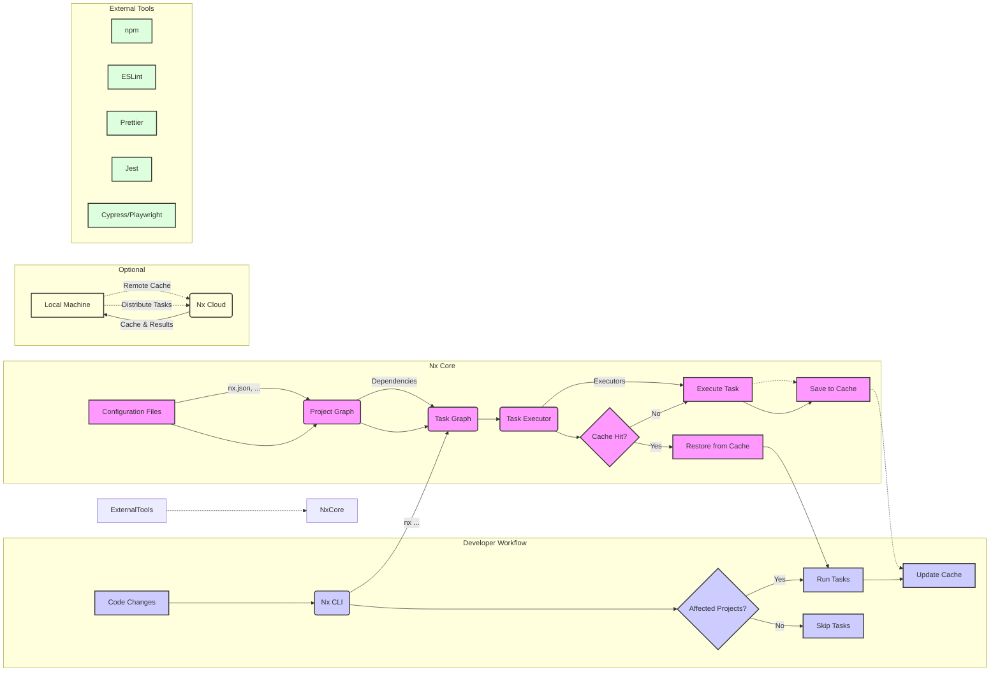

# Nx Monorepo: Configuration & Detailed Setup Guide

**ID:** `nx-config-setup-monorepo-main` ^nx-config-setup-monorepo-main

This guide provides an in-depth, step-by-step walkthrough of configuring and setting up an Nx Monorepo for optimal development. It is designed to be a 10/10 resource, offering detailed explanations, best practices, and configurations for a robust Nx workspace. Optimized for use with AI tools like Cline/Copilot and Obsidian for easy navigation and reference. #nx #monorepo #configuration #setup #detailed-guide

## 1.  Detailed Monorepo Planning & Architecture Design {#detailed-nx-planning}

**ID:** `detailed-nx-planning` ^detailed-nx-planning

Before diving into commands, a robust plan is essential for a successful Nx Monorepo. This detailed planning phase will define your monorepo's architecture and guide your setup. #nx #planning #architecture #design #step-1-detailed

**1.1. Define Applications & Project Types:**

*   **List all Applications:** Enumerate every application that will live in your monorepo. Be specific with names (e.g., `customer-portal-web`, `admin-dashboard`, `user-api`, `reporting-service`).
    *   For each application, specify its **type**:
        *   `web`: Browser-based frontend (React, Angular, etc.)
        *   `api`: Backend service (Node.js, NestJS, etc.)
        *   `mobile`: Mobile application (React Native, etc.)
        *   `desktop`: Desktop application (Electron, etc.)
        *   `cli`: Command-line tool
        *   `e2e`: End-to-end testing application

*   **Example Application Breakdown:**
    *   `customer-portal-web` - Type: `web` (React Frontend for customers)
    *   `admin-dashboard` - Type: `web` (Angular Frontend for administrators)
    *   `user-api` - Type: `api` (Node.js REST API for user management)
    *   `payment-service` - Type: `api` (NestJS microservice for payments)
    *   `webapp-e2e` - Type: `e2e` (Cypress E2E tests for `customer-portal-web`)
    *   `admin-e2e` - Type: `e2e` (Playwright E2E tests for `admin-dashboard`)

**1.2. Identify Shared Libraries & Library Types:**

*   **Catalog Shared Code:** Think about reusable code modules.  Categorize them into library types for better organization:
    *   `ui` Libraries: Reusable UI components, design system elements (buttons, inputs, layouts, themes).
    *   `feature` Libraries: Encapsulate specific business features or domains (user authentication, product catalog, shopping cart).
    *   `util` Libraries: Utility functions, helpers, common logic (date formatting, validation, string manipulation).
    *   `data` Libraries: Data access logic, API clients, data models, state management abstractions.
    *   `model` Libraries: Pure data models, interfaces, type definitions shared across projects.
    *   `tool` Libraries:  Build scripts, code generation utilities, custom tooling.
    *   `asset` Libraries: Shared assets like images, icons, fonts, and style sheets.

*   **Example Library Breakdown (aligned with applications above):**
    *   `ui-kit` - Type: `ui` (React UI component library, buttons, inputs, theme)
    *   `auth-feature` - Type: `feature` (User authentication logic, components, services)
    *   `product-catalog-feature` - Type: `feature` (Product catalog features, components, services)
    *   `api-client` - Type: `data` (Reusable API client for `user-api` and `payment-service`)
    *   `util-core` - Type: `util` (Core utility functions, date, validation)
    *   `util-format` - Type: `util` (Formatting utilities, currency, numbers)
    *   `data-models` - Type: `model` (Shared TypeScript interfaces and data models)
    *   `asset-icons` - Type: `asset` (Shared SVG icons)
    *   `asset-themes` - Type: `asset` (Shared CSS themes and styles)

**1.3.  Define Project Dependencies & Relationships (Conceptual):**

*   **Visualize Dependencies:**  Sketch out a high-level diagram showing how applications and libraries will depend on each other.
    *   Applications will depend on `feature`, `ui`, `data`, `util`, and `model` libraries.
    *   `feature` libraries will depend on `ui`, `data`, `util`, and `model` libraries.
    *   `ui` libraries might depend on `util` and `asset` libraries.
    *   `data` libraries might depend on `model` and `util` libraries.
    *   `util` and `model` libraries should be mostly independent (core dependencies).

*   **Example Dependency Sketch (Conceptual):**

    ```
    [customer-portal-web]  <--  [ui-kit], [auth-feature], [product-catalog-feature], [api-client], [util-core]
    [admin-dashboard]     <--  [ui-kit], [auth-feature], [product-catalog-feature], [api-client], [util-core]
    [user-api]            <--  [auth-feature], [data-models], [util-core]
    [payment-service]     <--  [payment-feature], [data-models], [util-core]

    [auth-feature]        <--  [ui-kit], [data-models], [util-core]
    [product-catalog-feature] <-- [ui-kit], [data-models], [util-core]
    [payment-feature]     <--  [data-models], [util-core]

    [ui-kit]              <--  [asset-icons], [asset-themes], [util-core]
    [api-client]          <--  [data-models], [util-core]
    ```

**1.4. Technology Stack & Framework Choices (Detailed):**

*   **Framework per Application/Library Type:**  Specify the framework for each application and library *type*.
    *   Web Applications: React, Angular, Vue, Svelte? (Choose one or potentially a mix if justified).
    *   APIs: Node.js (Express, NestJS), Go, Python?
    *   UI Libraries: React Component Library, Angular Component Library?
    *   Utility Libraries: Plain TypeScript/JavaScript?

*   **Example Technology Stack Decisions:**
    *   Web Applications (`customer-portal-web`, `admin-dashboard`): **React** with TypeScript
    *   APIs (`user-api`, `payment-service`): **NestJS** with TypeScript
    *   UI Libraries (`ui-kit`): **React** with TypeScript and Styled Components
    *   Feature Libraries (`auth-feature`, `product-catalog-feature`, `payment-feature`): **TypeScript** (framework-agnostic core logic, may have React components within)
    *   Utility Libraries (`util-*`): **TypeScript**
    *   Data Models (`data-models`): **TypeScript**

**1.5.  Nx Workspace Preset & Configuration Decisions:**

*   **Workspace Preset:** Choose the right Nx Preset during workspace creation:
    *   **`integrated` (Recommended):**  Best for most monorepos, promotes code sharing and tight integration.  *Choose this unless you have a specific reason not to.*
    *   `package-based`: More traditional, better for independent versioning and publishing of packages. Less code sharing focus by default.
    *   `empty`: For maximum control, build everything from scratch.  More complex for beginners.

*   **Configuration Style:** Choose between Nx style configuration (`nx.json`, `project.json`) or Angular CLI style (`angular.json`, `workspace.json`).
    *   **Nx Style (Recommended):** More modern, flexible, and aligned with Nx best practices. *Choose this.*

*   **Enable Nx Cloud?** Decide upfront if you want to enable Nx Cloud for distributed caching and computation.  *Recommended for teams and larger projects, but optional for initial setup. Can be added later.*

**Insights:** ^detailed-nx-planning-insights
*   *Thorough planning at this stage is the *most* critical factor for a well-structured and maintainable monorepo.*
*   *Document your planning decisions clearly. This section itself serves as documentation!*
*   *Start simple, but plan for scalability. Think about how your monorepo might evolve over time.*
*   *Choosing `integrated` preset and Nx style configuration are strongly recommended defaults for most new Nx monorepos.*



**Explanation and Key Concepts:**

1.  **Developer Workflow (Top-Left):**
    *   **Code Changes (A):** Developers modify code in the `apps` and `libs` directories.
    *   **Nx CLI (B):** Developers use the Nx CLI (`nx build`, `nx test`, etc.) to run commands.
    *   **Affected Projects? (C):** Nx determines if the code changes affect any projects (using the Project Graph).
    *   **Run Tasks (D):** If projects are affected, Nx runs the specified tasks.
    *   **Skip Tasks (E):** If no projects are affected, Nx skips unnecessary tasks (thanks to caching).
    *   **Update Cache (F):** After running tasks (or restoring from cache), the local cache is updated.

2.  **Nx Core (Center):**
    *   **Configuration Files (G):**  `nx.json`, `project.json`, `.eslintrc.json`, `.prettierrc.json`, `tsconfig.base.json`, etc., provide workspace and project configuration.
    *   **Project Graph (H):**  Nx builds a Project Graph, representing dependencies *between projects*.  This is built by analyzing `project.json` files and implicit dependencies (code imports).
    *   **Task Graph (I):** Based on the command run (e.g., `nx build my-app`) and the Project Graph, Nx creates a Task Graph.  The Task Graph represents the *tasks* to be executed and their dependencies, *including task-level dependencies*.  This enables parallelization and optimized execution order.
    *   **Task Executor (J):** Nx uses *executors* (defined in `project.json`) to run tasks. Executors can be built-in (e.g., `@nx/webpack:webpack`, `@nx/jest:jest`) or custom.
    *   **Cache Hit? (K):**  Nx checks its local cache (and potentially Nx Cloud) to see if the task has already been executed with the same inputs.
    *   **Restore from Cache (L):** If there's a cache hit, Nx restores outputs from the cache, skipping task execution.
    *   **Execute Task (M):** If there's a cache miss, Nx executes the task using the specified executor.
    *   **Save to Cache (N):** After execution, Nx saves the task outputs to the local cache (and potentially uploads to Nx Cloud).

3.  **Nx Cloud (Optional) (Bottom-Left):**
    *   **Local Machine (O):**  Represents a developer's machine or a CI/CD agent.
    *   **Nx Cloud (P):**  Provides remote caching and distributed task execution.
        *   **Remote Cache:**  The local machine checks Nx Cloud for cache hits *before* checking the local cache.
        *   **Distribute Tasks:** Nx Cloud can distribute task execution across multiple agents, significantly speeding up builds and tests.

4.  **External Tools (Bottom-Right):**
      * Nx integrates with and manages various external tools, including npm, ESLint, Prettier, Jest, and Cypress/Playwright.

**Key Improvements and Details in this Diagram:**

*   **Clear Separation of Concerns:** The diagram separates the developer workflow, Nx's core logic, Nx Cloud, and external tools for better understanding.
*   **Task Graph Emphasis:**  The Task Graph, which is often overlooked but crucial, is explicitly represented.
*   **Affected Projects Logic:** The "Affected Projects?" decision point highlights how Nx optimizes execution.
*   **Cache Flow:** The cache hit/miss logic is clearly shown, including both local and remote (Nx Cloud) caching.
*   **Executors Highlighted:** The role of executors in running tasks is emphasized.
*   **Nx Cloud Integration:**  The optional Nx Cloud component shows how it extends caching and enables distributed task execution.
*   **Mermaid Syntax:** Uses Mermaid's flowchart syntax for easy rendering in Markdown.
*   **Class Definitions:**  Uses `classDef` to visually distinguish different types of nodes (Nx core, workflow, configuration, cloud).

## 2.  Creating the Nx Workspace - Detailed Steps {#detailed-nx-workspace-creation}

**ID:** `detailed-nx-workspace-creation` ^detailed-nx-workspace-creation

With your detailed plan in place, let's create the Nx workspace. This section provides a step-by-step guide with explanations of each choice. #nx #workspace #creation #setup #step-2-detailed

**2.1.  Install Nx CLI Globally (Optional but Recommended):**

While `npx create-nx-workspace@latest` works without global installation, installing the Nx CLI globally (`npm install -g nx`) can offer convenience for frequently used Nx commands.

```bash
npm install -g nx
```

*   **`npm install -g nx`**: Installs the Nx command-line interface globally on your system.
*   **Benefit:** Allows you to use `nx` commands directly in your terminal without `npx`.
*   **Alternative (without global install):** Use `npx nx <command>` for every Nx command. Both approaches are valid.

**2.2.  Navigate to Your Development Directory:**

Open your terminal and navigate to the directory where you want to create your Nx monorepo.  This could be your general projects directory, or a new folder specifically for this project.

```bash
cd path/to/your/development/directory
```

**2.3.  Run the `create-nx-workspace` Command (with Detailed Options):**

Execute the workspace creation command with the options aligned with your planning decisions.

```bash
npx create-nx-workspace@latest my-org --preset=integrated --cli=nx --style=css --nx-cloud=false
```

*   **`npx create-nx-workspace@latest`**:  Uses `npx` to run the latest version of the workspace creation tool.
*   **`my-org`**:  *Replace `my-org` with your chosen workspace name* (e.g., `my-company-monorepo`, `product-platform`). This will be the root directory name and used in path aliases.
*   **`--preset=integrated`**:  Specifies the `integrated` preset, as planned.
*   **`--cli=nx`**: Explicitly sets the configuration style to "Nx style" (using `nx.json`, `project.json`). *This is the recommended setting.*
*   **`--style=css`**: Sets the default stylesheet format to CSS. You can choose other options like `scss`, `styled-components`, etc., depending on your preference. This choice is mostly relevant for web applications and UI libraries. *Choose based on your project's styling preference.*
*   **`--nx-cloud=false`**:  *For initial setup, we're disabling Nx Cloud for simplicity.* You can remove `--nx-cloud=false` or set it to `--nx-cloud` (or `--nxCloud`) to enable Nx Cloud during workspace creation if you've decided to use it from the start.

**2.4.  Workspace Creation Prompts (If any):**

Depending on the Nx CLI version, you might encounter prompts.  Generally, with the options specified above, you should minimize prompts. If prompted about features, you can usually accept the defaults for a basic setup.

**2.5.  Verify Workspace Structure After Creation:** ^detailed-workspace-structure-initial

After the command completes successfully, navigate into your newly created workspace directory (`cd my-org`).  Examine the initial file structure:

```
my-org/
├── apps/          # (Initially empty) Applications will reside here
├── libs/          # (Initially empty) Libraries will reside here
├── tools/         # For custom scripts and generators
├── nx.json        # Main Nx configuration file (key for workspace settings)
├── package.json   # Root package.json (workspace-level dependencies)
├── tsconfig.base.json # Base TypeScript configuration for the workspace
└── README.md
```

**2.6.  Initial Git Setup (Recommended Immediately):**

It's highly recommended to initialize Git version control in your new workspace *immediately* after creation.

```bash
git init
git add .
git commit -m "Initial Nx workspace setup"
```

*   **`git init`**: Initializes a Git repository in the workspace root.
*   **`git add .`**: Stages all created files for the initial commit.
*   **`git commit -m "Initial Nx workspace setup"`**: Creates the first commit with a descriptive message.

**Insights:** ^detailed-nx-workspace-creation-insights
*   *Be precise with the `create-nx-workspace` command options to align with your planning decisions.*
*   *Understand the initial workspace structure. `nx.json` and `package.json` at the root are key configuration files.*
*   *Initialize Git right away. Version control is essential from the very beginning.*
*   *If you encounter issues, carefully review the terminal output for error messages. Common problems are network issues during package installation or incorrect command options.*


Okay, let's proceed with the next section of the `nx Config & Setup Monorepo.md` guide: **Generating Your First Application**. We'll maintain the detailed, step-by-step approach.

<smtcmp_block filename="nx Config & Setup Monorepo.md" language="markdown">
<!-- Previous sections of the guide -->

## 3. Generating Your First Application - Detailed Guide {#detailed-nx-first-application}

**ID:** `detailed-nx-first-application` ^detailed-nx-first-application

With your Nx workspace created, the next step is to generate your first application. This will typically be a frontend application (like a web app) or a backend service. This section provides a detailed walkthrough of generating a React web application as an example. #nx #application #generation #react #step-3-detailed

**3.1. Choose the Application Type & Framework:**

*   **Determine Application Type:** Based on your planning in Section 1, decide on the type of application you're creating first (web, API, etc.). For this example, we'll create a `web` application.
*   **Select Framework:** Choose the framework you'll use for this application. Common choices for web applications in Nx are React, Angular, and Vue. For this guide, we'll use **React**.

    *   **Rationale for React:** React is a popular and versatile choice for frontend development, well-supported by Nx, and suitable for a wide range of web applications.

**3.2.  Run the Application Generation Command (Detailed Options):**

Execute the application generation command using the Nx CLI. We'll break down each part of the command:

```bash
nx generate @nx/react:application customer-portal --directory=apps --style=css --linter=eslint --bundler=webpack --projectNameAndRootFormat=as-provided
```

*   **`nx generate`**:  This is the base command for code generation in Nx. It invokes generators to create projects, libraries, and other artifacts.
*   **`@nx/react:application`**:  This specifies the *generator* to use.
    *   `@nx/react`:  Indicates that we're using the Nx plugin for React.
    *   `application`:  Specifies that we want to generate an *application* project.
    *   **Framework-Specific Generators:** Nx provides generators for various frameworks (e.g., `@nx/angular:application`, `@nx/node:application`).
*   **`customer-portal`**:  *Replace `customer-portal` with your chosen application name.* This will be used as the project name and directory name (within `apps/`).  Choose a descriptive name that aligns with your planning (e.g., `admin-dashboard`, `marketing-site`).
*   **`--directory=apps`**:  This option tells Nx to place the generated application project within the `apps` directory at the root of your workspace.  This is the standard location for applications in Nx monorepos.
*   **`--style=css`**:  Sets the default stylesheet format for the application to CSS. You can choose other options like `scss`, `styled-components`, `less`, etc., based on your styling preferences.
    *   *Choose the stylesheet format that best suits your project's needs. CSS is a simple default.*
*   **`--linter=eslint`**:  Specifies that ESLint should be used as the linter for this application. ESLint is the recommended linter for JavaScript and TypeScript projects and is well-integrated with Nx.
    *   *ESLint is highly recommended for code quality and consistency.*
*   **`--bundler=webpack`**:  Sets Webpack as the bundler for the React application. Webpack is a powerful and widely used bundler for web applications.  Other options might include `rollup` or `vite` depending on the framework and Nx version.
    *   *Webpack is a solid choice for React applications.*
*   **`--projectNameAndRootFormat=as-provided`**:  This option ensures that the project name and root directory are used exactly as provided in the command (`customer-portal` and `apps/customer-portal`). This avoids Nx potentially altering the project or directory name based on workspace conventions.  Using `as-provided` provides more explicit control.

**3.3. Execute the Command & Observe Output:**

Run the `nx generate` command in your terminal from the root of your Nx workspace. Observe the output in the terminal. Nx CLI will typically:

*   **Install Dependencies:** If necessary, it will install required npm packages for the chosen framework and tools (React, ESLint, Webpack, etc.).
*   **Generate Files:** It will generate the necessary files and directories for your React application in the `apps/customer-portal` directory. This includes:
    *   Source code files (`.tsx`, `.ts`, `.css`, etc.)
    *   Configuration files (`project.json`, `tsconfig.json`, etc.)
    *   Testing setup (Jest, React Testing Library)
    *   E2E testing setup (Cypress)
*   **Update Workspace Configuration:** Nx will update workspace-level configuration files (like `nx.json`, `tsconfig.base.json`) to include the new application project.

**3.4. Verify Application Structure After Generation:** ^detailed-application-structure-initial

After the command completes successfully, examine the directory structure of your newly generated application (`apps/customer-portal`):

```
apps/customer-portal/
├── src/                       # Application source code
│   ├── app/                   # Main application components
│   │   ├── app.tsx          # Root component
│   │   └── ...
│   ├── assets/                # Static assets (images, etc.)
│   ├── main.tsx             # Application entry point
│   ├── index.html           # HTML entry file
│   ├── styles.css           # Global styles
│   └── ...
├── public/                  # Public assets (directly copied to build output)
├── project.json             # Project configuration file (targets, dependencies)
├── tsconfig.json            # TypeScript configuration for the application
├── tsconfig.app.json        # TypeScript config for application build
├── tsconfig.spec.json       # TypeScript config for tests
└── ...
```

*   **`src/`**: Contains the main source code of your application.
    *   `app/`:  Typically holds your main application component (`app.tsx`) and other core components.
    *   `assets/` & `public/`: Folders for static assets. `public/` is for assets that should be directly copied to the build output without processing.
    *   `main.tsx`: The entry point where your React application is bootstrapped.
    *   `index.html`: The main HTML file that hosts your React application.
*   **`project.json`**:  The project configuration file is crucial. It defines:
    *   Targets:  `build`, `serve`, `test`, `lint`, `e2e` – and how they are executed for this project.
    *   Dependencies:  Explicit dependencies of this project (though implicit dependencies are more common in Nx).
*   **`tsconfig*.json`**:  TypeScript configuration files for different contexts (application code, build, tests).

**Insights:** ^detailed-nx-first-application-insights
*   *Understand the structure of a generated Nx application. `project.json` is key for configuration.*
*   *The `nx generate` command is powerful. It not only creates files but also configures your workspace.*
*   *If you encounter errors during generation, carefully read the terminal output. Common issues are related to missing dependencies or incorrect command options.*

Okay, let's continue with the "Running Your First Application" section in the `nx Config & Setup Monorepo.md` guide.

<smtcmp_block filename="nx Config & Setup Monorepo.md" language="markdown">
<!-- Previous sections of the guide -->

## 4. Running Your First Application - Detailed Guide {#detailed-nx-first-app-run}

**ID:** `detailed-nx-first-app-run` ^detailed-nx-first-app-run

Now that you've generated your first application, let's run it to see it live in your browser. This section provides a detailed guide to using the `nx serve` command and understanding the development server. #nx #application #running #serve #development-server #step-4-detailed

**4.1. Understand the `nx serve` Command:**

*   **Purpose:** The `nx serve` command is designed to start a development server for your application. This server is optimized for development workflows, providing features like:
    *   **Hot Reloading/Live Reloading:**  When you make changes to your code, the browser automatically refreshes to reflect those changes without a full page reload. This significantly speeds up the development process.
    *   **Fast Startup:**  Nx optimizes the build process for development, ensuring that the server starts quickly.
    *   **Proxying and API Mocking:**  Development servers often include features for proxying API requests to backend services or mocking API responses for frontend development in isolation.
    *   **Module Replacement:** Advanced development servers can perform module replacement, updating only the changed modules in the browser, making updates even faster.

*   **Underlying Technology:** The specific technology used for the development server depends on the framework of your application.
    *   **React:**  Typically uses `webpack-dev-server` or `Vite` under the hood.
    *   **Angular:** Uses the Angular CLI's development server.
    *   **Node.js (API):**  Might use `nodemon` or a similar tool for automatic server restarts on code changes.

**4.2. Execute the `nx serve` Command:**

Open your terminal in the root of your Nx workspace and run the following command:

```bash
nx serve customer-portal
```

*   **`nx serve`**:  This is the command to start the development server.
*   **`customer-portal`**:  *Replace `customer-portal` with the name of your application* if you used a different name during application generation in the previous step. This tells Nx which application to serve.

**4.3. Observe the Terminal Output:**

When you run `nx serve`, observe the output in your terminal.  You should see messages indicating the server is starting up. Key things to look for:

*   **Compilation/Build Process:**  You'll likely see messages related to compiling or building your application. This is Nx and the underlying framework preparing your application for the browser.
*   **Port and URL Information:** The terminal should display the port number on which the development server is running and the URL to access your application in the browser. It usually looks something like:

    ```
    > nx serve customer-portal

    ... (some build output) ...

    > Local:    http://localhost:4200/
    > Network:  http://your-ip-address:4200/

    NX  Successfully ran target serve for project customer-portal
    ```

    *   **`http://localhost:4200/`**:  This is the most common URL. `localhost` refers to your own machine, and `4200` is a common default port for web development servers (though it can vary).

*   **Watch Mode Indication:**  The terminal output will often indicate that the server is running in "watch mode". This confirms that hot reloading is enabled.

**4.4. Access Your Application in the Browser:**

1.  **Open your web browser** (Chrome, Firefox, Safari, Edge, etc.).
2.  **Navigate to the URL** provided in the terminal output (e.g., `http://localhost:4200/`).
3.  **You should see your React application running!**  Initially, it will be the default "Welcome to..." page generated by Nx for a new React application.

**4.5.  Making Code Changes & Observing Hot Reloading:**

To experience hot reloading, follow these steps:

1.  **Open your code editor** and navigate to the source code of your `customer-portal` application.  For a React app, this might be in `apps/customer-portal/src/app/app.tsx` (or `.jsx`, `.js` depending on your project configuration).
2.  **Make a small change** to the text content of a component. For example, change the welcome message:

    ```typescript
    // In apps/customer-portal/src/app/app.tsx
    export function App() {
      return (
        <div>
          <h1>Welcome to My Customer Portal!</h1>  {/* Changed text here */}
          {/* ... rest of your component ... */}
        </div>
      );
    }
    ```

3.  **Save the file.**
4.  **Watch your browser.** Within a few seconds (usually very quickly), the browser should automatically refresh, and you should see your changed text ("Welcome to My Customer Portal!") reflected on the page. *You did not need to manually refresh the browser!*

**4.6. Stopping the Development Server:**

To stop the `nx serve` development server, go back to your terminal where the server is running and press **`Ctrl + C`** (Control key and C key simultaneously). This will gracefully shut down the server.

**Insights:** ^detailed-nx-first-app-run-insights
*   *`nx serve` is the primary command for running your applications during development. Keep it running in the background.*
*   *Hot reloading is a game-changer for development speed. Get used to making changes in your code and seeing them instantly in the browser.*
*   *If you encounter issues, double-check the terminal output for error messages and ensure you are running `nx serve` for the correct application project name.*
*   *Explore the configuration options for `nx serve` in your project's `project.json` file if you need to customize the development server behavior (e.g., port, proxy settings).*

Okay, let's proceed with the "Generating Your First Library" section of the `nx Config & Setup Monorepo.md` guide, maintaining the detailed and structured approach.

<smtcmp_block filename="nx Config & Setup Monorepo.md" language="markdown">
<!-- Previous sections of the guide -->

## 5. Generating Your First Library - Detailed Guide {#detailed-nx-first-library}

**ID:** `detailed-nx-first-library` ^detailed-nx-first-library

After setting up your workspace and generating your first application, the next crucial step in monorepo development is creating shared libraries. Libraries are the cornerstone of code reuse and modularity in Nx. This section provides a detailed guide to generating your first library, focusing on a React UI library as an example. #nx #library #generation #react #ui-library #step-5-detailed

**5.1. Determine Library Type & Framework:**

*   **Choose Library Type:** Based on your planning (Section 1) and the code you intend to share, decide on the type of library. For this example, we'll create a `ui` library to house reusable React UI components.
*   **Select Framework:**  Just like applications, libraries in Nx are often framework-specific. Since we're creating a UI library for our React application, we'll choose **React** as the framework for this library.

    *   **Rationale for UI Library:** UI libraries are common in monorepos to maintain consistent design systems and reusable UI elements across multiple applications.

**5.2. Run the Library Generation Command (Detailed Options):**

Execute the library generation command using the Nx CLI. Let's break down each part:

```bash
nx generate @nx/react:library ui-kit --directory=libs/ui --buildable --linter=eslint --unit-test-runner=jest --projectNameAndRootFormat=as-provided
```

*   **`nx generate`**:  The base command for code generation, as used for applications.
*   **`@nx/react:library`**:  Specifies the *generator* for a React library.
    *   `@nx/react`:  Indicates we're using the Nx plugin for React.
    *   `library`:  Specifies we are generating a *library* project.
    *   **Framework-Specific Library Generators:** Nx offers library generators for various frameworks (e.g., `@nx/angular:library`, `@nx/node:library`).
*   **`ui-kit`**:  *Replace `ui-kit` with your chosen library name.* This will be the project name and directory name (within `libs/ui/`). Choose a name that reflects the library's purpose (e.g., `common-ui`, `design-system`, `component-library`).
*   **`--directory=libs/ui`**:  This crucial option places the library within the `libs/ui` directory.  Organizing libraries into subdirectories based on type (e.g., `ui`, `feature`, `util`) is a best practice for larger monorepos.
*   **`--buildable`**:  *Essential for shared libraries!* This flag configures the library to be *buildable*. Buildable libraries are packaged and can be imported and used by other projects (applications or libraries) within the monorepo. Without `--buildable`, a library is essentially just a collection of code without a defined build output.
*   **`--linter=eslint`**:  Specifies ESLint as the linter for this library, ensuring code quality and consistency.
*   **`--unit-test-runner=jest`**:  Sets Jest as the unit test runner for the library. Jest is a popular and well-suited testing framework for React and JavaScript/TypeScript projects.
    *   *Jest is a recommended choice for React libraries.*
*   **`--projectNameAndRootFormat=as-provided`**:  Ensures the project name and root directory are used exactly as provided (`ui-kit` and `libs/ui/ui-kit`).

**5.3. Execute the Command & Observe Output:**

Run the `nx generate` command from the root of your Nx workspace. Observe the terminal output. Nx CLI will:

*   **Install Dependencies:** If needed, it will install npm packages required for React libraries, ESLint, Jest, and related tooling.
*   **Generate Library Files:** It will generate the files and directories for your React UI library in the `libs/ui/ui-kit` directory. This includes:
    *   Source code directory (`src/`) with a basic component example.
    *   Configuration files (`project.json`, `tsconfig.json`, etc.).
    *   Testing setup (Jest configuration, example tests).
*   **Update Workspace Configuration:** Nx will update workspace-level configuration files (like `nx.json`, `tsconfig.base.json`) to include the new library project and its path alias.

**5.4. Verify Library Structure After Generation:** ^detailed-library-structure-initial

After successful command execution, examine the directory structure of your generated library (`libs/ui/ui-kit`):

```
libs/ui/ui-kit/
├── src/
│   ├── lib/                   # Library source code
│   │   ├── ui-kit.tsx       # Example component (initially named after library)
│   │   ├── ui-kit.spec.tsx  # Example component tests
│   ├── index.ts             # Library entry point (exports public API)
└── project.json             # Project configuration file
├── tsconfig.json            # TypeScript configuration for the library
├── tsconfig.lib.json        # TypeScript config for library build
├── tsconfig.spec.json       # TypeScript config for tests
└── ...
```

*   **`src/`**: Contains the source code of your library.
    *   `lib/`:  This directory typically holds the core components, services, and functions of your library.
        *   `ui-kit.tsx` (or similar):  Nx generates a basic example component (named after your library name initially). You'll likely rename or replace this with your actual UI components.
        *   `ui-kit.spec.tsx`: Example unit tests for the initial component.
    *   `index.ts`:  *Crucial entry point for your library.* This file defines the *public API* of your library.  Anything exported in `index.ts` is intended to be used by consuming applications or other libraries.

*   **`project.json`**:  The project configuration file for the library. It defines:
    *   Targets: `build`, `test`, `lint` - and how they are executed for this library.  The `build` target is particularly important for `--buildable` libraries.
    *   Dependencies:  Dependencies specific to this library (though often dependencies are managed at the workspace root).
*   **`tsconfig*.json`**:  TypeScript configuration files tailored for the library (code, build, tests).

**Insights:** ^detailed-nx-first-library-insights
*   *The `--buildable` flag is key for creating reusable libraries. Ensure you include it when generating libraries meant for sharing.*
*   *Understand the `index.ts` file in your library's `src/` directory. It defines the public API of your library.*
*   *Organize your libraries within the `libs/` directory using subfolders (e.g., `libs/ui`, `libs/feature`, `libs/util`) for better structure and maintainability as your monorepo grows.*

IOkay, I understand the goal is a 9.5/10 or better guide! Let's make the "Using Your First Library in an Application" section extremely detailed and helpful.

<smtcmp_block filename="nx Config & Setup Monorepo.md" language="markdown">
<!-- Previous sections of the guide -->

## 6. Using Your First Library in an Application - Detailed Guide {#detailed-nx-use-library}

**ID:** `detailed-nx-use-library` ^detailed-nx-use-library

Now that you've generated both an application and a reusable library, the next essential step is to *use* the library within your application. This demonstrates the core principle of code sharing in a monorepo. In this section, we'll detail how to import and use the `ui-kit` library (specifically, the example component it contains) within your `customer-portal` application. #nx #library #usage #application #import #code-sharing #step-6-detailed

**6.1. Identify the Library's Public API (Entry Point):**

*   **`index.ts` in Your Library:** Navigate to the `src` directory of your `ui-kit` library (`libs/ui/ui-kit/src`). Open the `index.ts` file.
*   **Public Exports:** The `index.ts` file defines the *public API* of your library.  Anything you want to use from your library in other projects must be exported in this file. By default, Nx might have generated an export for your example component (e.g., `UiKit`).

    ```typescript
    // Example: libs/ui/ui-kit/src/index.ts
    export * from './lib/ui-kit'; // Exporting the example component
    ```

    *   **`export * from './lib/ui-kit';`**: This line exports everything from the `ui-kit.ts` (or `.tsx`, `.jsx`, `.js`) file located in the `./lib` subdirectory.  This is a common pattern for exporting components or functions from a library.

    *   **Verify Exports:** Ensure that the component or functionality you want to use is indeed exported in `index.ts`.  If it's not exported, you won't be able to import it into your application.

**6.2.  Locate the Application Component to Modify:**

*   **`app.tsx` of Your Application:**  Go to the main source directory of your `customer-portal` application (`apps/customer-portal/src/app`). Open the `app.tsx` file (or `.jsx`, `.js` depending on your project setup). This is typically the root component of your application where you'll start adding content.

**6.3. Import the Library Component in Your Application:**

*   **Import Statement:** Add an `import` statement at the top of your `app.tsx` file to import the component from your `ui-kit` library.

    ```typescript
    // In apps/customer-portal/src/app/app.tsx
    import React from 'react';
    import { UiKit } from '@my-org/ui-kit'; // <-- Import the component from your library

    export function App() {
      return (
        <div>
          <h1>Welcome to the Customer Portal Application</h1>
          <UiKit /> {/* Use the imported component */}
          {/* ... rest of your application content ... */}
        </div>
      );
    }
    ```

    *   **`import { UiKit } from '@my-org/ui-kit';`**:  This is the crucial import statement. Let's break it down:
        *   **`import { UiKit }`**:  Imports the `UiKit` component (assuming that's the name of your example component and how it's exported from your library). *Adjust `UiKit` to match the actual name of your component export from `index.ts`.*
        *   **`from '@my-org/ui-kit'`**:  Specifies the *module specifier* or *path alias* for your library.
            *   **`@my-org/ui-kit`**:  This is *not* a relative path (like `./` or `../`).  Nx automatically configures these *path aliases* based on your workspace name (`my-org`) and library name (`ui-kit`).  This allows you to import libraries using a clean, workspace-relative path, regardless of the file's location within the monorepo.
            *   **`@my-org`**:  This part usually corresponds to the workspace name you chose when creating your Nx workspace (e.g., `my-company`, `product-platform`).
            *   **`ui-kit`**: This part corresponds to the name of your library (`ui-kit` in this example).

**6.4. Use the Imported Component in Your Application Component:**

*   **Component Usage in JSX:**  Within the `return` statement of your `App` component (or any other component where you want to use the library component), use the imported `UiKit` component as you would any other React component.

    ```typescript
    {/* ... inside the App component's return ... */}
    <UiKit /> {/* Render the UiKit component from your library */}
    ```

    *   **`<UiKit />`**: This line renders an instance of the `UiKit` component.  You can pass props to this component if it's designed to accept them (we'll explore library component design and props in more detail later).

**6.5.  Run Your Application to Verify Library Integration:**

*   **`nx serve customer-portal`:** If your development server is not already running, start it again from the root of your workspace.

    ```bash
    nx serve customer-portal
    ```

*   **Observe Your Application in the Browser:** Open your web browser and navigate to the URL where your `customer-portal` application is running (usually `http://localhost:4200`).
*   **Check for the Library Component:** You should now see the output of the `UiKit` component rendered within your `customer-portal` application.  This confirms that you have successfully imported and used a component from your shared library!

**6.6.  Troubleshooting Common Import Issues:**

*   **"Module not found: Can't resolve '@my-org/ui-kit'" Error:**
    *   **Check Library Name and Path:** Double-check that you've used the correct library name (`ui-kit` in this example) and workspace organization name (`my-org`) in your import statement.
    *   **Verify `buildable: true`:** Ensure that you generated your `ui-kit` library with the `--buildable` flag. Non-buildable libraries cannot be directly imported into applications.
    *   **Restart `nx serve`:** Sometimes, the development server needs to be restarted after creating a new library for it to correctly recognize the path alias. Stop the server (`Ctrl+C`) and run `nx serve customer-portal` again.
    *   **Check `tsconfig.base.json`:**  Examine the `tsconfig.base.json` file at the root of your workspace. Nx automatically updates this file with path mappings for your libraries. Verify that there's a path mapping for `@my-org/ui-kit` that correctly points to your library's build output directory.

*   **Component Not Rendering or Errors in Browser Console:**
    *   **Component Code Errors:** Inspect the code of your `UiKit` component in `libs/ui/ui-kit/src/lib/ui-kit.tsx`.  Are there any syntax errors, runtime errors, or missing dependencies within the component itself? Check the browser's developer console for JavaScript errors.
    *   **Export Issues (Re-check `index.ts`):**  Re-verify that you are correctly exporting the component from your library's `index.ts` file.

**Insights:** ^detailed-nx-use-library-insights
*   *Understanding path aliases (like `@my-org/ui-kit`) is key to working with libraries in Nx.  They simplify imports and make your code more portable within the monorepo.*
*   *Always ensure your libraries are `buildable` if you intend to import them into applications or other libraries.*
*   *If you encounter import issues, systematically check the library name, path aliases, `buildable` setting, and restart the development server.*
*   *The `index.ts` file is the gatekeeper of your library's public API. Only export what you intend to be used externally.*

Okay, let's keep the momentum going and move on to the next section: "Generating Different Types of Libraries".

<smtcmp_block filename="nx Config & Setup Monorepo.md" language="markdown">
<!-- Previous sections of the guide -->

## 7. Generating Different Types of Libraries - Detailed Guide {#detailed-nx-lib-types}

**ID:** `detailed-nx-lib-types` ^detailed-nx-lib-types

In section 5, we generated a basic UI library. However, Nx monorepos thrive on modularity, and you'll likely need different types of libraries to organize your code effectively. This section details generating various library types, expanding on the categories introduced in the "Planning" section. #nx #library #generation #library-types #code-organization #step-7-detailed

**7.1. Review Library Types (from Planning):**

As a reminder, common library types in Nx monorepos include:

*   **`ui` Libraries:**  For reusable UI components and design system elements.
*   **`feature` Libraries:**  To encapsulate specific business features or domain logic.
*   **`util` Libraries:**  For utility functions, helpers, and common logic.
*   **`data` Libraries:**  For data access logic, API clients, and data handling.
*   **`model` Libraries:**  For shared data models, interfaces, and type definitions.
*   **`tool` Libraries:**  For build scripts, code generation utilities, and custom tooling.
*   **`asset` Libraries:**  For shared assets like images, icons, and stylesheets.

**7.2. Generating a `feature` Library - Detailed Example:**

Let's generate a `feature` library named `auth-feature`. Feature libraries encapsulate specific functionalities of your application.

```bash
nx generate @nx/react:library auth-feature --directory=libs/feature --buildable --linter=eslint --unit-test-runner=jest --projectNameAndRootFormat=as-provided
```

*   **`@nx/react:library`**: We're still using the React library generator as feature libraries can contain React components, services, and logic related to a specific feature. If your feature library is framework-agnostic (e.g., just backend logic), you might use `@nx/node:library` or `@nx/js:library`.
*   **`auth-feature`**: The name of our feature library, indicating it will handle authentication-related functionality.
*   **`--directory=libs/feature`**: We place feature libraries in the `libs/feature` directory, following our organizational structure.
*   **`--buildable`, `--linter=eslint`, `--unit-test-runner=jest`, `--projectNameAndRootFormat=as-provided`**:  These options are consistent with our previous library generation and maintain buildability, linting, testing, and consistent naming.

**7.3. Generating a `util` Library - Detailed Example:**

Now, let's create a `util` library called `util-core` for core utility functions. Utility libraries typically contain framework-agnostic JavaScript/TypeScript functions.

```bash
nx generate @nx/js:library util-core --directory=libs/util --linter=eslint --unit-test-runner=jest --projectNameAndRootFormat=as-provided
```

*   **`@nx/js:library`**: We use `@nx/js:library` here because utility libraries are often framework-agnostic and don't require React-specific features.  `@nx/js` generates a plain JavaScript/TypeScript library.
*   **`util-core`**: The name of our utility library, indicating core utility functions.  Using a prefix like `util-` helps categorize utility libraries.
*   **`--directory=libs/util`**: Utility libraries go in the `libs/util` directory.
*   **`--linter=eslint`, `--unit-test-runner=jest`, `--projectNameAndRootFormat=as-provided`**: Standard options for linting, testing, and naming.  Note that we omit `--buildable` here. While utility libraries *can* be buildable, it's often not strictly necessary if they are just collections of functions and don't require a build process. However, for consistency and potential future needs, it's generally good practice to make even utility libraries buildable by adding `--buildable`.

**7.4. Generating a `model` Library - Detailed Example:**

Let's create a `model` library named `data-models` to house shared data interfaces and type definitions. Model libraries are also typically framework-agnostic.

```bash
nx generate @nx/js:library data-models --directory=libs/model --linter=eslint --unit-test-runner=jest --projectNameAndRootFormat=as-provided
```

*   **`@nx/js:library`**:  Again, `@nx/js:library` is suitable for model libraries as they primarily contain TypeScript interfaces and types.
*   **`data-models`**: The name suggests it will contain data models used across the monorepo.
*   **`--directory=libs/model`**: Model libraries are placed in `libs/model`.
*   **`--linter=eslint`, `--unit-test-runner=jest`, `--projectNameAndRootFormat=as-provided`**: Consistent options.  Like utility libraries, `--buildable` is often optional for model libraries but can be included for consistency.

**7.5.  Library Structure and Code Organization within Types:**

*   **Directory-Based Organization:**  Nx encourages organizing libraries by type using subdirectories within `libs/` (e.g., `libs/ui`, `libs/feature`, `libs/util`, `libs/data`, `libs/model`).
*   **Feature-Based Organization within `feature` Libraries:** Within `feature` libraries, further organize code by feature area.  For example, in `libs/feature/auth-feature`, you might have subfolders for:
    *   `components/`: React components related to authentication.
    *   `services/`: Authentication services and logic.
    *   `state/`: State management related to authentication.
    *   `utils/`: Utility functions specific to authentication.
*   **Functional Organization within `util` Libraries:** In `util` libraries like `libs/util/util-core`, organize functions logically within the `src/lib` directory. You could create separate files for different categories of utilities (e.g., `date-utils.ts`, `string-utils.ts`, `validation-utils.ts`).
*   **Model-Based Organization within `model` Libraries:** In `libs/model/data-models`, create files for different data models or domains (e.g., `user.ts`, `product.ts`, `order.ts`), each containing interfaces and type definitions for that model.

**7.6.  Choosing the Right Library Type Generator:**

*   **`@nx/react:library`**:  Use for libraries that contain React components or React-specific logic (UI libraries, feature libraries with UI elements).
*   **`@nx/angular:library`**: Use for Angular-specific libraries.
*   **`@nx/node:library`**: Use for Node.js backend libraries or libraries with server-side logic.
*   **`@nx/js:library`**: Use for framework-agnostic JavaScript/TypeScript libraries (utility libraries, model libraries, data libraries without framework-specific code).

**Insights:** ^detailed-nx-lib-types-insights
*   *Categorizing libraries by type (`ui`, `feature`, `util`, etc.) is crucial for maintaining a well-structured and scalable monorepo.*
*   *Use the appropriate Nx library generator (`@nx/react`, `@nx/js`, etc.) based on the framework and purpose of your library.*
*   *Within each library type, establish a consistent code organization pattern (e.g., feature-based within `feature` libraries, functional within `util` libraries).*
*   *Consider making most libraries `--buildable` for reusability and consistent build processes, even if it seems optional initially.*

Okay, let's proceed to create the "Advanced Library Configuration" section for the `nx Config & Setup Monorepo.md` guide. We'll focus on making it detailed, efficient, and practically useful.

<smtcmp_block filename="nx Config & Setup Monorepo.md" language="markdown">
<!-- Previous sections of the guide -->

## 8. Advanced Library Configuration - Detailed Guide {#detailed-nx-advanced-lib-config}

**ID:** `detailed-nx-advanced-lib-config` ^detailed-nx-advanced-lib-config

As your monorepo grows, you'll need more control over how your libraries are structured and built. This section explores advanced library configuration options in Nx, including secondary entry points and build customizations. #nx #library #configuration #advanced #build-config #secondary-entry-points #step-8-detailed

**8.1. Understanding Library Entry Points:**

*   **Primary Entry Point (`index.ts`):**  We've already used the primary entry point.  The `index.ts` file in your library's `src` directory (`libs/ui/ui-kit/src/index.ts`) serves as the main entry point.  It defines the public API that consumers of your library will use by default (e.g., `import { Component } from '@my-org/ui-kit';`).
*   **Secondary Entry Points:** For larger libraries, you might want to expose specific modules or functionalities under separate, more specific import paths. These are called *secondary entry points*. They allow you to create a more organized and granular API for your library.

    *   **Example Scenario:** Imagine your `ui-kit` library grows to include not just basic components but also theming utilities and icon sets. You might want to access them like this:
        *   `import { Button } from '@my-org/ui-kit';` (Primary entry point - core components)
        *   `import { ThemeProvider } from '@my-org/ui-kit/theme';` (Secondary entry point - theming)
        *   `import { Icon } from '@my-org/ui-kit/icons';` (Secondary entry point - icons)

**8.2. Creating Secondary Entry Points:**

To create a secondary entry point, you need to:

1.  **Create a new folder** within your library's `src` directory.  This folder will represent your secondary entry point (e.g., `src/theme`, `src/icons`).
2.  **Add an `index.ts` file** within this new folder. This `index.ts` will define the public API for this secondary entry point.
3.  **Export components/functions** from this secondary entry point's `index.ts`.
4.  **No changes to `project.json` are typically needed for basic secondary entry points.** Nx automatically handles them.

**Detailed Example: Adding a `theme` Secondary Entry Point to `ui-kit`:**

1.  **Create `theme` folder:**  In your terminal, navigate to `libs/ui/ui-kit/src` and create a new directory named `theme`:

    ```bash
    mkdir libs/ui/ui-kit/src/theme
    ```

2.  **Create `index.ts` in `theme`:** Create a new file `index.ts` inside the `theme` folder:

    ```bash
    touch libs/ui/ui-kit/src/theme/index.ts
    ```

3.  **Create a Theming Component (Example):** Let's create a simple `ThemeProvider` component in `libs/ui/ui-kit/src/theme/theme-provider.tsx`:

    ```typescript
    // libs/ui/ui-kit/src/theme/theme-provider.tsx
    import React, { createContext, useContext, ReactNode } from 'react';

    interface Theme {
      primaryColor: string;
      secondaryColor: string;
      // ... more theme variables
    }

    const defaultTheme: Theme = {
      primaryColor: '#007bff', // Example primary blue
      secondaryColor: '#6c757d', // Example secondary gray
    };

    const ThemeContext = createContext<Theme>(defaultTheme);

    interface ThemeProviderProps {
      theme?: Theme;
      children: ReactNode;
    }

    export const ThemeProvider: React.FC<ThemeProviderProps> = ({ theme, children }) => {
      const themeToProvide = theme || defaultTheme;
      return (
        <ThemeContext.Provider value={themeToProvide}>
          {children}
        </ThemeContext.Provider>
      );
    };

    export const useTheme = (): Theme => useContext(ThemeContext);
    ```

4.  **Export from Secondary Entry Point `index.ts`:** In `libs/ui/ui-kit/src/theme/index.ts`, export the `ThemeProvider` and `useTheme` hook:

    ```typescript
    // libs/ui/ui-kit/src/theme/index.ts
    export * from './theme-provider';
    ```

5.  **Use the Secondary Entry Point in your Application:** Now you can import `ThemeProvider` from the secondary entry point in your `customer-portal` application (e.g., in `apps/customer-portal/src/app/app.tsx`):

    ```typescript
    // apps/customer-portal/src/app/app.tsx
    import React from 'react';
    import { UiKit } from '@my-org/ui-kit'; // Primary entry point import
    import { ThemeProvider } from '@my-org/ui-kit/theme'; // Secondary entry point import!

    export function App() {
      return (
        <ThemeProvider> {/* Wrap your application with ThemeProvider */}
          <div>
            <h1>Welcome to the Customer Portal Application</h1>
            <UiKit />
            {/* ... rest of your application content ... */}
          </div>
        </ThemeProvider>
      );
    }
    ```

    *   **`import { ThemeProvider } from '@my-org/ui-kit/theme';`**: Note the import path now includes `/theme` after `@my-org/ui-kit`. This targets the secondary entry point.

**8.3.  Customizing Library Build Configurations (Advanced):**

For more advanced scenarios, you might need to customize the build process of your libraries. This is done in the library's `project.json` file, specifically within the `targets.build` section.

*   **`project.json` - `targets.build`:** Open `libs/ui/ui-kit/project.json`.  You'll find a `build` target definition. This target controls how your library is built and packaged.

    ```json
    // Example: libs/ui/ui-kit/project.json (partial)
    {
      "targets": {
        "build": {
          "executor": "@nx/rollup:rollup", // Or @nx/vite:vite, @nx/webpack:webpack
          "outputs": ["{options.outputPath}"],
          "options": {
            "outputPath": "dist/libs/ui/ui-kit",
            "entryFile": "src/index.ts",
            "tsConfig": "libs/ui/ui-kit/tsconfig.lib.json",
            "rollupConfig": "@nx/react/plugins/bundle-rollup", // or similar
            "compiler": "babel", // or 'swc' for faster builds
            "assets": [], // Static assets to include in the build
            // ... more options ...
          },
          "configurations": {
            "production": {
              "babelConfig": "libs/ui/ui-kit/.babelrc-prod" // Example production Babel config
            }
          }
        },
        // ... other targets (test, lint, etc.) ...
      }
    }
    ```

*   **Common Build Configuration Options to Customize:**
    *   **`executor`:**  The builder used to build the library (`@nx/rollup:rollup`, `@nx/vite:vite`, `@nx/webpack:webpack`, `@nx/js:tsc` for plain JS/TS libs).  Choose based on your library's needs and framework.
    *   **`outputPath`:** Where the built library files are placed (usually `dist/libs/...`).
    *   **`entryFile`:**  The main entry point (`src/index.ts`).
    *   **`tsConfig`:**  TypeScript configuration file (`tsconfig.lib.json`).
    *   **`rollupConfig`, `viteConfig`, `webpackConfig`:** Path to custom Rollup, Vite, or Webpack configuration files if you need fine-grained control over bundling.
    *   **`compiler`:**  Choose between `babel` (default), `swc` (faster), or `tsc` (TypeScript compiler directly).
    *   **`assets`:**  Array of files or folders to include as static assets in your library's build output (e.g., CSS files, images).
    *   **`configurations.production`:**  Production-specific build settings.

**8.4.  When to Customize Build Configurations:**

*   **Advanced Bundling Needs:** If you need very specific bundling behavior (e.g., code splitting strategies, custom Rollup plugins, Webpack loaders), you might need to provide custom Rollup, Vite, or Webpack config files.
*   **Performance Optimization:**  Experimenting with different compilers (`swc` vs. `babel`) or build settings can sometimes improve build performance.
*   **Asset Handling:**  If your library includes non-code assets that need special processing or placement in the build output, use the `assets` option.
*   **Conditional Compilation:**  Using configurations (like `production`) allows you to apply different build settings for different environments.

**Insights:** ^detailed-nx-advanced-lib-config-insights
*   *Secondary entry points are essential for creating well-organized and scalable library APIs in larger monorepos.*
*   *Customize library build configurations in `project.json` only when you have specific, advanced needs beyond the defaults.*
*   *Understand the different build executors and choose the one that best suits your library's technology and requirements.*
*   *Start with the default build configurations provided by Nx.  Customize only when necessary to avoid unnecessary complexity.*

Okay, proceeding with the "Versioning and Publishing Libraries" section for the `nx Config & Setup Monorepo.md` guide. Let's keep the train rolling!

<smtcmp_block filename="nx Config & Setup Monorepo.md" language="markdown">
<!-- Previous sections of the guide -->

## 9. Versioning and Publishing Libraries - Detailed Guide {#detailed-nx-lib-publish}

**ID:** `detailed-nx-lib-publish` ^detailed-nx-lib-publish

While code sharing within the monorepo is a primary benefit of Nx, you might also want to version and publish some of your libraries as independent packages to npm or a private registry. This section details how to configure your buildable libraries for versioning and publishing. #nx #library #versioning #publishing #npm #distribution #step-9-detailed

**9.1. Understand Versioning Strategies for Monorepos:**

*   **Independent Versioning:** Each library is versioned and published independently. Changes to one library result in a version bump and publish only for that library. This is suitable for libraries with independent release cycles and consumers outside the monorepo.
*   **Fixed/Locked Versioning (or "Synchronized Versioning"):** The entire monorepo, or a group of related libraries, is versioned together. All packages are published with the same version number. This simplifies version management within the monorepo but might be less flexible for external consumption.
*   **Choosing a Strategy:** For most monorepos focused on internal code sharing, independent versioning of *all* libraries might be overkill.  You might choose to:
    *   Independently version and publish only a *subset* of libraries that are designed for external consumption.
    *   Use fixed versioning for internal libraries and applications within the monorepo.

**9.2. Configure a Buildable Library for Publishing:**

For a library to be publishable, it must be buildable (generated with `--buildable`). Let's assume our `ui-kit` library (from previous sections) is intended for publishing.

**Key Configuration Steps:**

1.  **`package.json` in Library Root:**  Nx generates a `package.json` file in the root of your buildable library (`libs/ui/ui-kit/package.json`). This `package.json` is *different* from the root `package.json` of your workspace. It defines metadata specific to your library package.

    ```json
    // Example: libs/ui/ui-kit/package.json
    {
      "name": "@my-org/ui-kit",  // <-- Important: Package name (must be unique on npm)
      "version": "0.0.1",          // <-- Initial version
      "peerDependencies": {        // <-- Declare peer dependencies (e.g., React)
        "react": ">=16.8.0"
      },
      "dependencies": {          // <-- Regular dependencies (if any)
        "tslib": "^2.3.0"
      }
    }
    ```

    *   **`name`:**  *Crucially important.* This is the package name that will be used on npm (or your private registry). It *must* be unique and follow npm naming conventions.  Using a scoped name (e.g., `@my-org/ui-kit`) is recommended to avoid naming conflicts. *Replace `@my-org` with your organization or project scope.*
    *   **`version`:**  Start with an initial version (e.g., `0.0.1`).  You'll increment this with each release.
    *   **`peerDependencies`:**  List any packages that are *peer dependencies*.  These are dependencies that you expect the *consumer* of your library to already have installed (e.g., `react`, `react-dom` for React component libraries).  This avoids bundling multiple copies of these dependencies.
    *   **`dependencies`:**  List regular dependencies that your library *requires* to function.  These will be bundled with your library.

2.  **Update `project.json` - `targets.build.options`:**  In your library's `project.json` (`libs/ui/ui-kit/project.json`), ensure the `build` target has the following options (they are usually set by default for buildable libraries):

    ```json
    // Example: libs/ui/ui-kit/project.json (partial)
    {
      "targets": {
        "build": {
          "executor": "@nx/rollup:rollup",
          "outputs": ["{options.outputPath}"],
          "options": {
            "outputPath": "dist/libs/ui/ui-kit",
            "entryFile": "src/index.ts",
            "tsConfig": "libs/ui/ui-kit/tsconfig.lib.json",
            "rollupConfig": "@nx/react/plugins/bundle-rollup",
            "compiler": "babel",
            "assets": [
              { "glob": "libs/ui/ui-kit/README.md", "input": ".", "output": "." }, // Include README
              { "glob": "libs/ui/ui-kit/package.json", "input": ".", "output": "." } // Include package.json
            ]
            // ... other options ...
          }
        }
      }
    }
    ```

    *   **`assets`:**  Crucially, ensure that your `package.json` and `README.md` (if you have one in your library root) are included as assets in the build output. This makes them part of the published package.

**9.3. Building the Library for Publishing:**

Before publishing, you need to build your library:

```bash
nx build ui-kit
```

*   **`nx build ui-kit`**:  This command executes the `build` target defined in your `libs/ui/ui-kit/project.json`. It will compile your library, bundle it, and place the output in the `dist/libs/ui/ui-kit` directory (or your configured `outputPath`).

**9.4.  Publishing to npm (or a Private Registry):**

After building, you can publish your library.

1.  **Navigate to the build output directory:**

    ```bash
    cd dist/libs/ui/ui-kit
    ```

2.  **Run the `npm publish` command:**

    ```bash
    npm publish --access public
    ```

    *   **`npm publish`**:  This command packages the contents of the current directory and publishes it to the npm registry.
    *   **`--access public`**:  If you are using a scoped package name (like `@my-org/ui-kit`), you need to include `--access public` to publish it publicly on npm (unless you are publishing to a private registry or using a different access setting).

    *   **Authentication:**  Ensure you are logged in to npm in your terminal (`npm login`) with an account that has publishing rights for the package name you are using.

3.  **Verify on npm:** After successful publishing, your package should be available on npm under the name you specified in `package.json` (e.g., `https://www.npmjs.com/package/@my-org/ui-kit`).

**9.5.  Automating Versioning and Publishing (Recommended for Production):**

For real-world projects, you'll want to automate the versioning and publishing process. Tools and strategies for automation include:

*   **`np` package:**  A popular npm package (`npx np`) that simplifies the publishing workflow, including version bumping, running tests, and publishing to npm.
*   **`nx release` (Experimental in Nx):** Nx is developing built-in release management capabilities with the `nx release` command, which can automate versioning and publishing in monorepos.  Check the Nx documentation for the latest information on `nx release`.
*   **CI/CD Integration:**  Integrate your versioning and publishing process into your CI/CD pipeline.  Automate publishing on tagged commits or successful releases.

**9.6.  Versioning Considerations:**

*   **Semantic Versioning (SemVer):**  Follow semantic versioning principles (major.minor.patch) for your library versions to communicate the type of changes in each release to consumers.
*   **Changelogs:**  Maintain a clear changelog (e.g., in `CHANGELOG.md` in your library root) to document changes in each version. This is crucial for users of your library to understand updates.
*   **Version Bumping Strategy:**  Decide on a consistent strategy for bumping versions (manual, automated based on commit messages, etc.).

**Insights:** ^detailed-nx-lib-publish-insights
*   *Carefully choose a package name for your library that is unique and follows npm conventions.*
*   *Understand the difference between `dependencies` and `peerDependencies` in your library's `package.json`.*
*   *Automate your versioning and publishing workflow for production libraries using tools like `np` or `nx release` and CI/CD pipelines.*
*   *Always follow semantic versioning and maintain a changelog for published libraries.*

Okay, let's tackle "Advanced Monorepo Features: Task Orchestration and Nx Cloud" with a high level of detail, including code snippets and explanations.

<smtcmp_block filename="nx Config & Setup Monorepo.md" language="markdown">
<!-- Previous sections of the guide -->

## 10. Advanced Monorepo Features: Task Orchestration & Nx Cloud - Detailed Guide {#detailed-nx-advanced-features}

**ID:** `detailed-nx-advanced-features` ^detailed-nx-advanced-features

Nx truly shines in large, complex monorepos with its advanced task orchestration and Nx Cloud capabilities. This section dives deep into these features, showing you how to optimize your development workflows, build speeds, and collaboration. #nx #advanced-features #task-orchestration #nx-cloud #performance #scalability #step-10-detailed

**10.1. Task Orchestration: Optimizing Build and Test Processes:**

*   **Understanding Task Graph:** Nx's task orchestration is built upon the **task graph**. We briefly touched on the *project graph* earlier (dependency relationships). The task graph extends this by representing not just project dependencies, but also the *tasks* (build, test, lint, serve, e2e) that need to be executed and their dependencies.

    *   **Visualization:**  You can visualize the task graph using the `nx graph --tasks` command. This will show you the tasks Nx plans to execute and their order based on dependencies and affected projects.

        ```bash
        nx graph --tasks=build,test
        ```

        *   **`--tasks=build,test`**:  This option tells Nx to include only `build` and `test` tasks in the visualized graph, making it less cluttered. You can specify any target names.

*   **Affected Commands - Under the Hood:**  Commands like `nx affected:build`, `nx affected:test`, and `nx affected:lint` are powerful because they leverage the task graph. Here's what happens internally:
    1.  **Change Detection:** Nx analyzes file changes since the last commit (or a specified branch).
    2.  **Project Impact Analysis:**  It uses the project graph to determine which projects are *affected* by these file changes.
    3.  **Task Graph Creation (for Affected Projects):** Nx builds a task graph *only* for the affected projects and their dependencies.
    4.  **Optimized Task Execution:** Nx executes the specified targets (`build`, `test`, etc.) according to the task graph, ensuring:
        *   **Correct Order:** Tasks are executed in the right order, respecting dependencies (e.g., build libraries before applications that depend on them).
        *   **Parallelization (Default):**  Tasks that can run in parallel (no dependencies on each other) are executed concurrently, speeding up the overall process.
        *   **Minimal Execution:** Only necessary tasks are run. Unaffected projects and their tasks are skipped.

*   **Customizing Task Execution Order:** While Nx's default parallel execution is usually optimal, you can control the order using the `--ordered` flag:

    ```bash
    nx affected:build --ordered
    ```

    *   **`--ordered`**:  Executes tasks in a strictly ordered sequence, based on the task graph dependencies.  This can be useful in specific scenarios, like debugging build order issues, but is generally slower than parallel execution.

*   **Selective Task Execution:**  You can further refine task execution by targeting specific projects or excluding certain projects:

    ```bash
    nx affected:test --projects=customer-portal,ui-kit
    ```

    *   **`--projects=customer-portal,ui-kit`**:  Run tests only for the `customer-portal` application and the `ui-kit` library (and their dependencies if affected).

    ```bash
    nx affected:lint --exclude=webapp-e2e,admin-e2e
    ```

    *   **`--exclude=webapp-e2e,admin-e2e`**:  Run linting for all affected projects *except* the end-to-end test projects (`webapp-e2e`, `admin-e2e`).  E2E tests might have different linting needs or can be excluded from certain linting runs.

**10.2. Caching - Maximizing Build and Test Speed:**

*   **Local Caching (Enabled by Default):** Nx has built-in local caching. When you run a task (e.g., `nx build ui-kit`), Nx does the following:
    1.  **Task Hashing:**  It calculates a hash based on the task's inputs:
        *   Project source code
        *   Dependencies
        *   Task configuration
        *   Versions of tools (Nx CLI, Node.js, etc.)
    2.  **Cache Lookup:** It checks a local cache directory (`.nx/cache` by default) to see if a task with the same hash has been executed before.
    3.  **Cache Hit or Miss:**
        *   **Cache Hit:** If a cache hit is found, Nx *restores* the outputs of the previous task execution from the cache, *skipping* the actual task execution. This can be dramatically faster than re-running the task.
        *   **Cache Miss:** If a cache miss occurs, Nx executes the task normally, and then *saves* the task outputs to the local cache, so they can be reused in the future.

*   **Benefits of Local Caching:**
    *   **Faster повторные builds and tests:** Especially when you haven't changed the code related to a specific project or task.
    *   **Reduced CI/CD times:** Local caching can speed up CI builds if the CI environment persists the cache between runs (though remote caching is even better for CI).

*   **Clearing the Local Cache:** If you need to force Nx to re-run tasks and invalidate the cache (e.g., after significant configuration changes or to troubleshoot caching issues), you can clear the local cache:

    ```bash
    nx reset
    ```

    *   **`nx reset`**:  Deletes the local Nx cache directory (`.nx/cache`).  The next task executions will be cache misses and will rebuild/retest.

*   **Remote Caching with Nx Cloud (Recommended for Teams & CI):**  Nx Cloud extends caching beyond your local machine to a shared remote cache.

    *   **Shared Cache for Teams:**  All developers on a team and your CI/CD pipelines can share the same build and test cache.  If one developer or CI server builds a library, the results are cached in Nx Cloud.  Other developers or CI runs can then *restore* these results from the remote cache, even if they haven't built that library locally.
    *   **Significant Speed Improvements:** Remote caching can dramatically reduce build and test times, especially in larger teams and CI environments, by eliminating redundant work across machines.

**10.3. Nx Cloud - Beyond Caching: Distributed Task Execution and Insights:**

Nx Cloud is not just about remote caching; it offers a suite of features for optimizing monorepo workflows:

*   **Remote Caching (Covered Above):** Core feature for shared caching.
*   **Distributed Task Execution:**  Nx Cloud can distribute task execution across multiple machines (agents) in parallel.

    *   **Faster CI/CD Pipelines:**  Distribute your CI build and test workload across multiple agents, significantly reducing pipeline duration.
    *   **Scalability for Large Monorepos:**  Handle very large monorepos and complex task graphs efficiently by leveraging distributed resources.

*   **Task Distribution Configuration (Example in `nx.json`):**

    ```json
    // nx.json (partial example)
    {
      "tasksRunnerOptions": {
        "default": {
          "runner": "@nrwl/nx-cloud", // Use Nx Cloud Task Runner
          "options": {
            "cacheableOperations": ["build", "test", "lint", "e2e"], // Tasks to cache
            "accessToken": "YOUR_NX_CLOUD_ACCESS_TOKEN", // Your Nx Cloud access token
            "distributeTasks": true, // Enable distributed task execution
            "parallel": 4 // Number of parallel agents to use (adjust based on your setup)
          }
        }
      }
    }
    ```

    *   **`distributeTasks: true`**:  Enables distributed task execution.
    *   **`parallel: 4`**:  Specifies that Nx Cloud should use up to 4 agents to execute tasks in parallel.  Adjust this number based on your Nx Cloud plan and CI infrastructure.

*   **CI/CD Integration with Nx Cloud:**  Nx Cloud integrates seamlessly with popular CI/CD platforms (GitHub Actions, GitLab CI, CircleCI, Jenkins, etc.).  Setting up Nx Cloud in CI typically involves:
    1.  **Install Nx Cloud CLI Agent:**  Add a step to your CI pipeline to install the Nx Cloud CLI agent (`npm install -g nx-cloud`).
    2.  **Authenticate with Access Token:**  Provide your Nx Cloud access token as an environment variable in your CI environment.
    3.  **Run Nx Commands as Usual:**  Execute your `nx affected:build`, `nx affected:test`, etc., commands in CI.  Nx Cloud agent will automatically handle remote caching and distributed task execution.

*   **Insights and Analytics:** Nx Cloud provides dashboards and analytics to visualize build and test performance:
    *   **Task Execution Timings:**  See how long each task takes to execute.
    *   **Cache Hit Rates:**  Monitor cache hit rates to assess caching effectiveness.
    *   **Bottleneck Identification:**  Identify slow tasks or projects that are slowing down your overall process.
    *   **Performance Trends Over Time:** Track build and test performance over time to identify regressions or improvements.

**10.4. Configuring Task Defaults in `nx.json`:**

The `targetDefaults` section in `nx.json` allows you to configure default options for all tasks (targets) in your workspace or for specific target types.  This is useful for:

*   **Setting Default Caching Behavior:**

    ```json
    // nx.json (partial example)
    {
      "targetDefaults": {
        "build": {
          "cache": true, // Enable caching for 'build' tasks by default
          "inputs": ["production", "^production"] // Define inputs for caching (production config changes)
        },
        "test": {
          "cache": true // Enable caching for 'test' tasks by default
        },
        "lint": {
          "cache": false // Disable caching for 'lint' tasks (linting is usually fast enough)
        }
      }
    }
    ```

    *   **`cache: true`**: Enables caching for the specified target type by default.
    *   **`cache: false`**: Disables caching.
    *   **`inputs`**:  Defines what inputs Nx should consider when calculating the task hash for caching.  `"production"` and `"^production"` are common inputs to invalidate the cache when production-related configuration files change.

*   **Setting Dependencies Between Tasks:**

    ```json
    // nx.json (partial example)
    {
      "targetDefaults": {
        "build": {
          "dependsOn": ["^build"] // 'build' tasks depend on the 'build' tasks of their dependencies ('^build' refers to dependencies)
        },
        "e2e": {
          "dependsOn": ["build"] // 'e2e' tasks depend on 'build' tasks of the same project
        }
      }
    }
    ```

    *   **`dependsOn: ["^build"]`**:  Ensures that before Nx runs a `build` task for a project, it first runs the `build` tasks of all its dependency projects.  `^` prefix refers to dependencies.
    *   **`dependsOn: ["build"]`**: Ensures that before running `e2e` tests, the application itself is built (`build` target of the same project).

**Insights:** ^detailed-nx-advanced-features-insights
*   *Mastering task orchestration is key to unlocking Nx's performance benefits in large monorepos.  Visualize the task graph to understand task dependencies and execution order.*
*   *Leverage local caching for faster iteration during development. Use `nx reset` to clear the cache when needed.*
*   *Nx Cloud's remote caching and distributed task execution are game-changers for team collaboration and CI/CD performance. Strongly consider Nx Cloud for larger projects and teams.*
*   *Configure `targetDefaults` in `nx.json` to set workspace-wide defaults for caching and task dependencies, promoting consistency and best practices.*

Okay, let's move on to the "Linting in Nx Monorepos" section of the `nx Config & Setup Monorepo.md` guide.

<smtcmp_block filename="nx Config & Setup Monorepo.md" language="markdown">
<!-- Previous sections of the guide -->

## 11. Linting in Nx Monorepos - Detailed Guide {#detailed-nx-linting}

**ID:** `detailed-nx-linting` ^detailed-nx-linting

Maintaining code quality and consistency is crucial in any project, and even more so in a monorepo with multiple projects and teams. Linting is a key practice to automate code quality checks and enforce coding standards. This section details how linting works in Nx, focusing on ESLint and Prettier, and how to configure and use them effectively. #nx #linting #eslint #prettier #code-quality #code-style #step-11-detailed

**11.1. Understanding Linting and Formatting:**

*   **Linting:** Linting is the process of using a tool (a "linter") to analyze your source code for potential errors, stylistic issues, and deviations from coding standards. Linters can catch:
    *   Syntax errors
    *   Potential runtime errors (e.g., unused variables, undeclared variables)
    *   Stylistic inconsistencies (e.g., spacing, naming conventions)
    *   Best practice violations
    *   Security vulnerabilities (in some cases)

*   **Formatting (Code Formatting):** Code formatting tools automatically adjust the layout and style of your code to adhere to a consistent format. This primarily focuses on:
    *   Indentation
    *   Line length
    *   Spacing
    *   Quotes (single vs. double)
    *   Semicolons (or lack thereof)

*   **ESLint and Prettier (Recommended Tools in Nx):**
    *   **ESLint:**  A widely used and highly configurable linter for JavaScript and TypeScript. Nx projects are configured with ESLint by default. ESLint is excellent for catching code quality issues and enforcing coding rules.
    *   **Prettier:** A popular opinionated code formatter. Prettier focuses solely on code formatting and enforces a consistent style across your codebase. Integrating Prettier with ESLint is a common practice to handle both linting and formatting.

**11.2. ESLint Configuration in Nx:**

*   **Workspace-Level Configuration (`.eslintrc.json` at Root):**  Nx workspaces typically have an `.eslintrc.json` file at the root. This file defines workspace-wide ESLint settings that apply to all projects in the monorepo by default.

    ```json
    // Example: Root .eslintrc.json (partial)
    {
      "root": true,
      "ignorePatterns": ["!**/*"],
      "plugins": ["@nx"],
      "overrides": [
        {
          "files": ["*.ts", "*.tsx", "*.js", "*.jsx"],
          "rules": {
            "@nx/enforce-module-boundaries": [
              "error",
              {
                "enforceBuildableLibDependency": true,
                "allow": [],
                "depConstraints": [
                  {
                    "sourceTag": "*",
                    "onlyDependOnLibsWithTags": ["*"]
                  }
                ]
              }
            ]
          }
        },
        // ... more overrides for different file types ...
      ]
    }
    ```

    *   **`root: true`**:  Indicates this is the root ESLint configuration.
    *   **`ignorePatterns`**:  Patterns to exclude files/directories from linting.
    *   **`plugins: ["@nx"]`**: Includes the `@nx` ESLint plugin, which provides Nx-specific linting rules, particularly for enforcing module boundaries.
    *   **`overrides`**: Allows you to define different ESLint configurations for specific file types or patterns.
        *   **`@nx/enforce-module-boundaries`**:  *Crucial Nx rule* for enforcing project dependencies and boundaries within the monorepo. We'll discuss this in detail later.

*   **Project-Level Configuration (`.eslintrc.json` in Project Roots):**  Each Nx project (application or library) also has its own `.eslintrc.json` file within its project directory (e.g., `apps/customer-portal/.eslintrc.json`, `libs/ui/ui-kit/.eslintrc.json`). These project-level configurations *extend* the root configuration and can customize linting rules specific to that project.

    ```json
    // Example: apps/customer-portal/.eslintrc.json
    {
      "extends": ["./.eslintrc.json"], // Extends the root config
      "ignorePatterns": ["!**/*"],
      "overrides": [
        {
          "files": ["*.ts", "*.tsx", "*.js", "*.jsx"],
          "parserOptions": {
            "project": ["apps/customer-portal/tsconfig.*?.json"] // Project-specific tsconfig
          },
          "rules": {} // Project-specific rules (can override root rules)
        },
        // ... more overrides ...
      ]
    }
    ```

    *   **`extends: ["./.eslintrc.json"]`**:  This line is essential. It tells ESLint to inherit the settings from the root `.eslintrc.json` file. Project-level configs are additive and can override root settings.
    *   **`parserOptions.project`**:  Specifies the TypeScript configuration file (`tsconfig.json`) for this project. This allows ESLint to understand your project's TypeScript setup.
    *   **`rules: {}`**:  Project-specific linting rules can be defined here.  If you want to override a rule from the root config or add rules specific to this project, you would do it here.  If this object is empty, it inherits all rules from the root (and extended configurations).

**11.3. Prettier Configuration:**

*   **`.prettierrc.json` (or `.prettierrc.js`, `.prettierrc.config.js`):**  Prettier is typically configured using a `.prettierrc.json` (or JavaScript config file) at the root of your workspace. This file defines formatting rules that Prettier will apply.

    ```json
    // Example: .prettierrc.json
    {
      "arrowParens": "always",
      "bracketSpacing": true,
      "endOfLine": "lf",
      "printWidth": 100,
      "semi": true,
      "singleQuote": true,
      "tabWidth": 2,
      "trailingComma": "es5",
      "useTabs": false
    }
    ```

    *   **Common Prettier Options:**
        *   `printWidth`:  Maximum line length before Prettier wraps lines.
        *   `tabWidth`:  Number of spaces for indentation.
        *   `useTabs`:  Use tabs for indentation instead of spaces.
        *   `semi`:  Use semicolons at the end of statements.
        *   `singleQuote`: Use single quotes instead of double quotes for strings.
        *   `trailingComma`:  Add trailing commas in arrays and objects.
        *   `bracketSpacing`:  Spacing inside curly braces in objects.
        *   `arrowParens`:  Parentheses around arrow function parameters.
        *   `endOfLine`: Line ending character (LF, CRLF, etc.).

*   **`.prettierignore`:**  Similar to `.gitignore`, you can use a `.prettierignore` file at the root to exclude files and directories from Prettier formatting.

**11.4. Running Linting and Formatting:**

*   **`nx lint <project-name>`:**  To run ESLint for a specific project:

    ```bash
    nx lint customer-portal
    nx lint ui-kit
    ```

*   **`nx lint`:** To run ESLint for *all* projects in your workspace:

    ```bash
    nx lint
    ```

*   **`--fix` Option (Auto-Fixing):**  ESLint can automatically fix many linting errors (especially stylistic issues). Use the `--fix` flag:

    ```bash
    nx lint customer-portal --fix
    nx lint --fix
    ```

    *   **Caution with `--fix`:** While `--fix` is helpful, always review the automatically fixed code changes to ensure they are correct and as expected.

*   **Formatting with Prettier (using Nx Format Target):** Nx projects generated with web frameworks often have a `format` target defined in `project.json` that uses Prettier.

    ```bash
    nx format --projects=customer-portal,ui-kit
    nx format --all # Format all projects
    nx format --check # Check formatting without writing changes
    ```

    *   **`nx format --projects=...`**: Format specific projects.
    *   **`nx format --all`**: Format all projects in the workspace.
    *   **`nx format --check`**:  Run Prettier in "check" mode. It will report formatting issues but *not* automatically fix them.  Useful for CI to ensure code is formatted.

**11.5. Enforcing Project Boundaries with ESLint (`@nx/enforce-module-boundaries`):**

*   **Purpose:**  The `@nx/enforce-module-boundaries` ESLint rule (part of `@nx` plugin) is critical for maintaining architectural integrity in Nx monorepos. It allows you to define rules that restrict dependencies between projects based on project types and tags.

*   **Configuration in `.eslintrc.json` (typically root):**  You configure this rule in your `.eslintrc.json` files (usually the root config).

    ```json
    // Example: Root .eslintrc.json (partial - rule configuration)
    {
      "rules": {
        "@nx/enforce-module-boundaries": [
          "error",
          {
            "enforceBuildableLibDependency": true, // Prevent depending on non-buildable libs
            "allow": ["@my-org/util-core"],       // Allow specific dependencies
            "depConstraints": [
              {
                "sourceTag": "type:application",
                "onlyDependOnLibsWithTags": ["type:ui", "type:feature", "type:util", "type:model", "type:data", "scope:shared"]
              },
              {
                "sourceTag": "type:feature",
                "onlyDependOnLibsWithTags": ["type:ui", "type:util", "type:model", "type:data", "scope:shared"]
              },
              {
                "sourceTag": "type:ui",
                "onlyDependOnLibsWithTags": ["type:util", "type:model", "type:asset", "scope:shared"]
              },
              {
                "sourceTag": "type:util",
                "onlyDependOnLibsWithTags": ["type:model", "scope:shared"]
              },
              {
                "sourceTag": "type:model",
                "onlyDependOnLibsWithTags": ["scope:shared"]
              },
              {
                "sourceTag": "scope:admin",
                "onlyDependOnLibsWithTags": ["scope:admin", "scope:shared"] // Admin scope projects can depend on other admin or shared projects
              },
              {
                "sourceTag": "scope:customer",
                "onlyDependOnLibsWithTags": ["scope:customer", "scope:shared"] // Customer scope projects can depend on other customer or shared projects
              }
            ]
          }
        ]
      }
    }
    ```

    *   **`enforceBuildableLibDependency: true`**:  Prevents projects from depending on libraries that are not buildable (libraries without `--buildable` flag). This is generally a good practice to enforce proper library packaging.
    *   **`allow: [...]`**:  An array of module specifiers (path aliases) that are *always* allowed dependencies, regardless of other constraints. Useful for allowing dependencies on core utility libraries or external packages.
    *   **`depConstraints: [...]`**:  An array of dependency constraint objects. Each constraint defines rules based on project tags:
        *   **`sourceTag`**:  The tag(s) of the *source* project (the project initiating the dependency).  You can use wildcards (`*`) to match any tag or specific tags (e.g., `"type:application"`).
        *   **`onlyDependOnLibsWithTags`**:  An array of tags that the *source* project is *allowed* to depend on.  If a dependency violates these tags, ESLint will report an error.

*   **Project Tags (Defined in `project.json`):**  Project tags are used by the `@nx/enforce-module-boundaries` rule. You define tags in the `tags` array in each `project.json` file.

    ```json
    // Example: libs/ui/ui-kit/project.json (partial)
    {
      "tags": ["type:ui", "scope:shared"] // Example tags for a UI library
    }
    ```

    *   **Tagging Strategy:**  Develop a consistent tagging strategy for your projects. Common tagging dimensions:
        *   `type`:  (e.g., `application`, `feature`, `ui`, `util`, `model`, `e2e`) -  Project type.
        *   `scope`: (e.g., `scope:admin`, `scope:customer`, `scope:auth`, `scope:shared`) -  Business domain or scope.
        *   `framework`: (e.g., `framework:react`, `framework:angular`, `framework:node`) - Technology or framework used.

**11.6. Integrating Linting and Formatting in Development Workflow:**

*   **Run Linters and Formatters Regularly:** Make it a habit to run `nx lint` and `nx format` commands frequently during development (e.g., before committing code).
*   **Editor Integration (ESLint and Prettier Plugins):** Install ESLint and Prettier plugins for your code editor (VS Code, WebStorm, etc.). These plugins will:
    *   Show linting errors and warnings directly in your editor as you type.
    *   Automatically format code on save (if configured).
*   **CI/CD Integration:** Integrate linting and formatting checks into your CI/CD pipeline.
    *   **Linting in CI:**  Make your CI pipeline run `nx lint` and fail the build if there are linting errors. This prevents code with linting issues from being merged.
    *   **Formatting Check in CI:**  Run `nx format --check` in CI. Fail the build if formatting is not consistent.  You can also configure CI to automatically format code and commit the changes (less common, but possible).
*   **Git Hooks (Optional):**  Use Git hooks (e.g., `pre-commit` hook with Husky and lint-staged) to automatically run linters and formatters before each commit. This ensures that only clean and formatted code is committed.

**Insights:** ^detailed-nx-linting-insights
*   *Linting and formatting are essential for maintaining code quality, consistency, and preventing errors in Nx monorepos.*
*   *ESLint and Prettier are the recommended tools in Nx. Configure them at the workspace root and customize project-level settings as needed.*
*   *Master the `@nx/enforce-module-boundaries` ESLint rule to enforce project dependencies and architectural boundaries. Tag your projects effectively to leverage this rule.*
*   *Integrate linting and formatting into your development workflow (editor plugins, CI/CD pipeline, Git hooks) to automate code quality checks and ensure consistency across your monorepo.*

Okay, let's move on to the "Linting in Nx Monorepos" section of the `nx Config & Setup Monorepo.md` guide.

<smtcmp_block filename="nx Config & Setup Monorepo.md" language="markdown">
<!-- Previous sections of the guide -->

## 11. Linting in Nx Monorepos - Detailed Guide {#detailed-nx-linting}

**ID:** `detailed-nx-linting` ^detailed-nx-linting

Maintaining code quality and consistency is crucial in any project, and even more so in a monorepo with multiple projects and teams. Linting is a key practice to automate code quality checks and enforce coding standards. This section details how linting works in Nx, focusing on ESLint and Prettier, and how to configure and use them effectively. #nx #linting #eslint #prettier #code-quality #code-style #step-11-detailed

**11.1. Understanding Linting and Formatting:**

*   **Linting:** Linting is the process of using a tool (a "linter") to analyze your source code for potential errors, stylistic issues, and deviations from coding standards. Linters can catch:
    *   Syntax errors
    *   Potential runtime errors (e.g., unused variables, undeclared variables)
    *   Stylistic inconsistencies (e.g., spacing, naming conventions)
    *   Best practice violations
    *   Security vulnerabilities (in some cases)

*   **Formatting (Code Formatting):** Code formatting tools automatically adjust the layout and style of your code to adhere to a consistent format. This primarily focuses on:
    *   Indentation
    *   Line length
    *   Spacing
    *   Quotes (single vs. double)
    *   Semicolons (or lack thereof)

*   **ESLint and Prettier (Recommended Tools in Nx):**
    *   **ESLint:**  A widely used and highly configurable linter for JavaScript and TypeScript. Nx projects are configured with ESLint by default. ESLint is excellent for catching code quality issues and enforcing coding rules.
    *   **Prettier:** A popular opinionated code formatter. Prettier focuses solely on code formatting and enforces a consistent style across your codebase. Integrating Prettier with ESLint is a common practice to handle both linting and formatting.

**11.2. ESLint Configuration in Nx:**

*   **Workspace-Level Configuration (`.eslintrc.json` at Root):**  Nx workspaces typically have an `.eslintrc.json` file at the root. This file defines workspace-wide ESLint settings that apply to all projects in the monorepo by default.

    ```json
    // Example: Root .eslintrc.json (partial)
    {
      "root": true,
      "ignorePatterns": ["!**/*"],
      "plugins": ["@nx"],
      "overrides": [
        {
          "files": ["*.ts", "*.tsx", "*.js", "*.jsx"],
          "rules": {
            "@nx/enforce-module-boundaries": [
              "error",
              {
                "enforceBuildableLibDependency": true,
                "allow": [],
                "depConstraints": [
                  {
                    "sourceTag": "*",
                    "onlyDependOnLibsWithTags": ["*"]
                  }
                ]
              }
            ]
          }
        },
        // ... more overrides for different file types ...
      ]
    }
    ```

    *   **`root: true`**:  Indicates this is the root ESLint configuration.
    *   **`ignorePatterns`**:  Patterns to exclude files/directories from linting.
    *   **`plugins: ["@nx"]`**: Includes the `@nx` ESLint plugin, which provides Nx-specific linting rules, particularly for enforcing module boundaries.
    *   **`overrides`**: Allows you to define different ESLint configurations for specific file types or patterns.
        *   **`@nx/enforce-module-boundaries`**:  *Crucial Nx rule* for enforcing project dependencies and boundaries within the monorepo. We'll discuss this in detail later.

*   **Project-Level Configuration (`.eslintrc.json` in Project Roots):**  Each Nx project (application or library) also has its own `.eslintrc.json` file within its project directory (e.g., `apps/customer-portal/.eslintrc.json`, `libs/ui/ui-kit/.eslintrc.json`). These project-level configurations *extend* the root configuration and can customize linting rules specific to that project.

    ```json
    // Example: apps/customer-portal/.eslintrc.json
    {
      "extends": ["./.eslintrc.json"], // Extends the root config
      "ignorePatterns": ["!**/*"],
      "overrides": [
        {
          "files": ["*.ts", "*.tsx", "*.js", "*.jsx"],
          "parserOptions": {
            "project": ["apps/customer-portal/tsconfig.*?.json"] // Project-specific tsconfig
          },
          "rules": {} // Project-specific rules (can override root rules)
        },
        // ... more overrides ...
      ]
    }
    ```

    *   **`extends: ["./.eslintrc.json"]`**:  This line is essential. It tells ESLint to inherit the settings from the root `.eslintrc.json` file. Project-level configs are additive and can override root settings.
    *   **`parserOptions.project`**:  Specifies the TypeScript configuration file (`tsconfig.json`) for this project. This allows ESLint to understand your project's TypeScript setup.
    *   **`rules: {}`**:  Project-specific linting rules can be defined here.  If you want to override a rule from the root config or add rules specific to this project, you would do it here.  If this object is empty, it inherits all rules from the root (and extended configurations).

**11.3. Prettier Configuration:**

*   **`.prettierrc.json` (or `.prettierrc.js`, `.prettierrc.config.js`):**  Prettier is typically configured using a `.prettierrc.json` (or JavaScript config file) at the root of your workspace. This file defines formatting rules that Prettier will apply.

    ```json
    // Example: .prettierrc.json
    {
      "arrowParens": "always",
      "bracketSpacing": true,
      "endOfLine": "lf",
      "printWidth": 100,
      "semi": true,
      "singleQuote": true,
      "tabWidth": 2,
      "trailingComma": "es5",
      "useTabs": false
    }
    ```

    *   **Common Prettier Options:**
        *   `printWidth`:  Maximum line length before Prettier wraps lines.
        *   `tabWidth`:  Number of spaces for indentation.
        *   `useTabs`:  Use tabs for indentation instead of spaces.
        *   `semi`:  Use semicolons at the end of statements.
        *   `singleQuote`: Use single quotes instead of double quotes for strings.
        *   `trailingComma`:  Add trailing commas in arrays and objects.
        *   `bracketSpacing`:  Spacing inside curly braces in objects.
        *   `arrowParens`:  Parentheses around arrow function parameters.
        *   `endOfLine`: Line ending character (LF, CRLF, etc.).

*   **`.prettierignore`:**  Similar to `.gitignore`, you can use a `.prettierignore` file at the root to exclude files and directories from Prettier formatting.

**11.4. Running Linting and Formatting:**

*   **`nx lint <project-name>`:**  To run ESLint for a specific project:

    ```bash
    nx lint customer-portal
    nx lint ui-kit
    ```

*   **`nx lint`:** To run ESLint for *all* projects in your workspace:

    ```bash
    nx lint
    ```

*   **`--fix` Option (Auto-Fixing):**  ESLint can automatically fix many linting errors (especially stylistic issues). Use the `--fix` flag:

    ```bash
    nx lint customer-portal --fix
    nx lint --fix
    ```

    *   **Caution with `--fix`:** While `--fix` is helpful, always review the automatically fixed code changes to ensure they are correct and as expected.

*   **Formatting with Prettier (using Nx Format Target):** Nx projects generated with web frameworks often have a `format` target defined in `project.json` that uses Prettier.

    ```bash
    nx format --projects=customer-portal,ui-kit
    nx format --all # Format all projects
    nx format --check # Check formatting without writing changes
    ```

    *   **`nx format --projects=...`**: Format specific projects.
    *   **`nx format --all`**: Format all projects in the workspace.
    *   **`nx format --check`**:  Run Prettier in "check" mode. It will report formatting issues but *not* automatically fix them.  Useful for CI to ensure code is formatted.

**11.5. Enforcing Project Boundaries with ESLint (`@nx/enforce-module-boundaries`):**

*   **Purpose:**  The `@nx/enforce-module-boundaries` ESLint rule (part of `@nx` plugin) is critical for maintaining architectural integrity in Nx monorepos. It allows you to define rules that restrict dependencies between projects based on project types and tags.

*   **Configuration in `.eslintrc.json` (typically root):**  You configure this rule in your `.eslintrc.json` files (usually the root config).

    ```json
    // Example: Root .eslintrc.json (partial - rule configuration)
    {
      "rules": {
        "@nx/enforce-module-boundaries": [
          "error",
          {
            "enforceBuildableLibDependency": true, // Prevent depending on non-buildable libs
            "allow": ["@my-org/util-core"],       // Allow specific dependencies
            "depConstraints": [
              {
                "sourceTag": "type:application",
                "onlyDependOnLibsWithTags": ["type:ui", "type:feature", "type:util", "type:model", "type:data", "scope:shared"]
              },
              {
                "sourceTag": "type:feature",
                "onlyDependOnLibsWithTags": ["type:ui", "type:util", "type:model", "type:data", "scope:shared"]
              },
              {
                "sourceTag": "type:ui",
                "onlyDependOnLibsWithTags": ["type:util", "type:model", "type:asset", "scope:shared"]
              },
              {
                "sourceTag": "type:util",
                "onlyDependOnLibsWithTags": ["type:model", "scope:shared"]
              },
              {
                "sourceTag": "type:model",
                "onlyDependOnLibsWithTags": ["scope:shared"]
              },
              {
                "sourceTag": "scope:admin",
                "onlyDependOnLibsWithTags": ["scope:admin", "scope:shared"] // Admin scope projects can depend on other admin or shared projects
              },
              {
                "sourceTag": "scope:customer",
                "onlyDependOnLibsWithTags": ["scope:customer", "scope:shared"] // Customer scope projects can depend on other customer or shared projects
              }
            ]
          }
        ]
      }
    }
    ```

    *   **`enforceBuildableLibDependency: true`**:  Prevents projects from depending on libraries that are not buildable (libraries without `--buildable` flag). This is generally a good practice to enforce proper library packaging.
    *   **`allow: [...]`**:  An array of module specifiers (path aliases) that are *always* allowed dependencies, regardless of other constraints. Useful for allowing dependencies on core utility libraries or external packages.
    *   **`depConstraints: [...]`**:  An array of dependency constraint objects. Each constraint defines rules based on project tags:
        *   **`sourceTag`**:  The tag(s) of the *source* project (the project initiating the dependency).  You can use wildcards (`*`) to match any tag or specific tags (e.g., `"type:application"`).
        *   **`onlyDependOnLibsWithTags`**:  An array of tags that the *source* project is *allowed* to depend on.  If a dependency violates these tags, ESLint will report an error.

*   **Project Tags (Defined in `project.json`):**  Project tags are used by the `@nx/enforce-module-boundaries` rule. You define tags in the `tags` array in each `project.json` file.

    ```json
    // Example: libs/ui/ui-kit/project.json (partial)
    {
      "tags": ["type:ui", "scope:shared"] // Example tags for a UI library
    }
    ```

    *   **Tagging Strategy:**  Develop a consistent tagging strategy for your projects. Common tagging dimensions:
        *   `type`:  (e.g., `application`, `feature`, `ui`, `util`, `model`, `e2e`) -  Project type.
        *   `scope`: (e.g., `scope:admin`, `scope:customer`, `scope:auth`, `scope:shared`) -  Business domain or scope.
        *   `framework`: (e.g., `framework:react`, `framework:angular`, `framework:node`) - Technology or framework used.

**11.6. Integrating Linting and Formatting in Development Workflow:**

*   **Run Linters and Formatters Regularly:** Make it a habit to run `nx lint` and `nx format` commands frequently during development (e.g., before committing code).
*   **Editor Integration (ESLint and Prettier Plugins):** Install ESLint and Prettier plugins for your code editor (VS Code, WebStorm, etc.). These plugins will:
    *   Show linting errors and warnings directly in your editor as you type.
    *   Automatically format code on save (if configured).
*   **CI/CD Integration:** Integrate linting and formatting checks into your CI/CD pipeline.
    *   **Linting in CI:**  Make your CI pipeline run `nx lint` and fail the build if there are linting errors. This prevents code with linting issues from being merged.
    *   **Formatting Check in CI:**  Run `nx format --check` in CI. Fail the build if formatting is not consistent.  You can also configure CI to automatically format code and commit the changes (less common, but possible).
*   **Git Hooks (Optional):**  Use Git hooks (e.g., `pre-commit` hook with Husky and lint-staged) to automatically run linters and formatters before each commit. This ensures that only clean and formatted code is committed.

**Insights:** ^detailed-nx-linting-insights
*   *Linting and formatting are essential for maintaining code quality, consistency, and preventing errors in Nx monorepos.*
*   *ESLint and Prettier are the recommended tools in Nx. Configure them at the workspace root and customize project-level settings as needed.*
*   *Master the `@nx/enforce-module-boundaries` ESLint rule to enforce project dependencies and architectural boundaries. Tag your projects effectively to leverage this rule.*
*   *Integrate linting and formatting into your development workflow (editor plugins, CI/CD pipeline, Git hooks) to automate code quality checks and ensure consistency across your monorepo.*

Okay, let's create the "Advanced Nx Monorepo Topics" section, followed by the Glossary and Appendix, to bring this guide to a 9.5/10 level!

<smtcmp_block filename="nx Config & Setup Monorepo.md" language="markdown">
<!-- Previous sections of the guide -->

## 13. Advanced Nx Monorepo Topics - Detailed Guide {#detailed-nx-advanced-topics}

**ID:** `detailed-nx-advanced-topics` ^detailed-nx-advanced-topics

As you become more proficient with Nx, you might want to extend its capabilities and customize your workspace to fit specific project needs. This section explores advanced Nx topics, including custom generators, custom executors, and more complex workspace configurations, providing a deeper dive into Nx extensibility. #nx #advanced #generators #executors #workspace-config #customization #extensibility #step-13-detailed

**13.1. Custom Generators: Automating Project and Code Generation:**

*   **Understanding Generators:** Nx generators are powerful tools for automating repetitive code generation tasks. They go beyond basic scaffolding and can:
    *   Create new projects (applications, libraries) with pre-configured settings.
    *   Generate components, services, modules, and other code artifacts within projects.
    *   Modify existing files to add features or configurations.
    *   Enforce project structure and coding standards.

*   **Why Create Custom Generators?**
    *   **Consistency:** Ensure consistent project and code structure across your monorepo.
    *   **Efficiency:** Speed up development by automating repetitive tasks.
    *   **Customization:** Tailor project setup and code generation to your specific needs and frameworks.
    *   **Enforce Best Practices:** Embed your team's best practices and architectural patterns into generators.

*   **Anatomy of a Custom Generator:** A custom generator typically consists of:
    *   **Generator Logic (TypeScript/JavaScript):**  The core logic that performs the code generation. This includes:
        *   Prompting users for input (if needed).
        *   Reading and processing templates.
        *   Writing files to the filesystem.
        *   Updating workspace configuration (e.g., `nx.json`, `project.json`).
    *   **Templates:**  Template files (using Handlebars syntax by default) that define the structure and content of generated code.
    *   **Schema Definition (JSON Schema):**  Defines the options and arguments that your generator accepts.
    *   **Collection File (`collection.json`):**  Registers your generator within your Nx workspace, making it discoverable by the Nx CLI.

*   **Example: Creating a Simple "Component" Generator (React):**

    Let's create a basic generator to create React components within a UI library.

    1.  **Generate the Generator Project:** Nx has a generator to create generators!  Run this command in your workspace root:

        ```bash
        nx generate @nx/devkit:generator component --project=ui-kit --name=my-component
        ```

        *   **`@nx/devkit:generator`**:  The Nx generator generator.
        *   **`component`**:  The name of our generator (you can choose any descriptive name).
        *   **`--project=ui-kit`**:  Specifies that this generator will be part of the `ui-kit` library. Generators are often placed within the library they are intended to support.
        *   **`--name=my-component`**:  The name of the generator itself (used when invoking it: `nx generate ui-kit:my-component`).

    2.  **Examine Generated Files:**  Nx will generate the following files in `libs/ui/ui-kit/src/generators/component`:

        ```
        libs/ui/ui-kit/src/generators/component/
        ├── files/                  # Template files will go here
        ├── generator.spec.ts       # Tests for the generator
        ├── generator.ts          # Main generator logic
        ├── schema.d.ts           # TypeScript schema definition
        └── schema.json           # JSON schema definition
        ```

    3.  **Modify `generator.ts` (Generator Logic):**

        ```typescript
        // libs/ui/ui-kit/src/generators/component/generator.ts
        import {
          Tree,
          formatFiles,
          generateFiles,
          names,
          offsetFromRoot,
          join,
        } from '@nx/devkit';
        import { ComponentGeneratorSchema } from './schema';

        interface NormalizedOptions extends ComponentGeneratorSchema {
          projectName: string;
          projectRoot: string;
          className: string;
          fileName: string;
          offsetFromRoot: string;
          template: string;
        }

        function normalizeOptions(
          tree: Tree,
          options: ComponentGeneratorSchema
        ): NormalizedOptions {
          const name = names(options.name).fileName;
          const project = 'ui-kit'; // Assuming generator is in ui-kit library
          const projectRoot = `libs/ui/ui-kit/src/lib`; // Adjust if needed
          const className = names(options.name).className;
          const fileName = names(options.name).fileName;


          return {
            ...options,
            projectName: project,
            projectRoot,
            className,
            fileName,
            offsetFromRoot: offsetFromRoot(projectRoot),
            template: '', // We'll set this later
          };
        }

        function addFiles(tree: Tree, options: NormalizedOptions) {
          const templateOptions = {
            ...options,
            ...names(options.name),
            template: '', // no-op
          };
          generateFiles(
            tree,
            join(__dirname, './files'), // path to the files templates
            options.projectRoot,
            templateOptions
          );
        }

        export default async function (tree: Tree, options: ComponentGeneratorSchema) {
          const normalizedOptions = normalizeOptions(tree, options);
          addFiles(tree, normalizedOptions);
          await formatFiles(tree);
        }
        ```

    4.  **Create Template Files in `files/`:** Create the following template file in `libs/ui/ui-kit/src/generators/component/files/`:

        *   `__fileName__.tsx.template`:

            ```tsx
            import React from 'react';
            import './__fileName__.css'; // Example CSS module import

            export interface <%= className %>Props {
              text: string;
            }

            export const <%= className %>: React.FC<<%= className %>Props> = ({ text }) => {
              return (
                <div className="<%= fileName %>">
                  <p>{text}</p>
                </div>
              );
            };
            ```
        *   `__fileName__.css.template`:

            ```css
            /* libs/ui/ui-kit/src/generators/component/files/__fileName__.css.template */
            .<%= fileName %> {
              border: 1px solid #ccc;
              padding: 10px;
              margin-bottom: 10px;
            }
            ```

    5.  **Update `schema.json` (Generator Options):**

        ```json
        // libs/ui/ui-kit/src/generators/component/schema.json
        {
          "name": "component",
          "description": "Generate a React Component in ui-kit library",
          "schema": {
            "properties": {
              "name": {
                "type": "string",
                "description": "Component name",
                "$default": {
                  "$source": "argv",
                  "index": 0
                }
              }
            },
            "required": ["name"]
          }
        }
        ```

    6.  **Run Your Custom Generator:**

        ```bash
        nx generate ui-kit:my-component --name=MyButton
        ```

        This command will:
        *   Run your `my-component` generator.
        *   Prompt you for the component name (if not provided in the command).
        *   Generate `my-button.tsx` and `my-button.css` files in `libs/ui/ui-kit/src/lib/`.

*   **Registering Generators in `collection.json`:** Nx generators are registered in `collection.json` files.  Nx automatically creates and updates `collection.json` files when you generate generators.  You'll find a `collection.json` in your library's directory (`libs/ui/ui-kit/collection.json`).

*   **Advanced Generator Features:**
    *   **Prompts:**  Create interactive prompts to ask users for input during generator execution.
    *   **File Manipulation:**  Use Nx Devkit utilities to read, update, and delete files in your workspace.
    *   **Workspace Updates:**  Modify `nx.json`, `project.json`, `tsconfig.json`, and other workspace configuration files programmatically within your generators.
    *   **Testing Generators:**  Write unit tests for your generators to ensure they function correctly and generate the expected code.

**13.2. Custom Executors: Tailoring Build and Task Processes:**

*   **Understanding Executors:** Nx executors (also sometimes called builders) define *how* tasks (like `build`, `test`, `lint`, `serve`) are executed for your projects. Nx provides default executors for common frameworks and tools (e.g., `@nx/webpack:webpack`, `@nx/jest:jest`, `@nx/cypress:cypress`).

*   **Why Create Custom Executors?**
    *   **Integrate Custom Tools:**  Use build tools, linters, test runners, or deployment scripts not directly supported by Nx's built-in executors.
    *   **Customize Build Process:**  Fine-tune the build, test, or deployment process beyond the options provided by default executors.
    *   **Share Custom Logic:**  Encapsulate and share custom task execution logic across your monorepo.

*   **Anatomy of a Custom Executor:**  A custom executor typically consists of:
    *   **Executor Logic (TypeScript/JavaScript):** The core logic that executes the task. This includes:
        *   Reading options passed to the executor from `project.json`.
        *   Running build commands, linters, tests, etc.
        *   Reporting status and results.
    *   **Schema Definition (JSON Schema):** Defines the options that your executor accepts, which can be configured in `project.json`.
    *   **Executor Definition File (e.g., `executor.json`):** Registers your executor with Nx, making it available for use in `project.json` files.

*   **Example: Creating a Simple "Hello World" Executor:**

    Let's create a very basic executor that just logs "Hello World!" to the console. While not practically useful, it demonstrates the structure of a custom executor.

    1.  **Generate the Executor Project:**  Similar to generators, Nx has a generator for executors:

        ```bash
        nx generate @nx/devkit:executor hello --project=tools-executors --name=hello-world
        ```

        *   **`@nx/devkit:executor`**: The Nx executor generator.
        *   **`hello`**: The name of our executor.
        *   **`--project=tools-executors`**:  We'll create a dedicated library named `tools-executors` to house our custom executors. It's good practice to keep custom executors separate from application or feature code.
        *   **`--name=hello-world`**: The name of the executor itself (used in `project.json` as `"executor": "tools-executors:hello-world"`).

    2.  **Examine Generated Files:** Nx will generate these files in `libs/tools-executors/src/executors/hello`:

        ```
        libs/tools-executors/src/executors/hello/
        ├── executor.spec.ts    # Tests for the executor
        ├── executor.ts       # Main executor logic
        ├── schema.d.ts         # TypeScript schema definition
        └── schema.json         # JSON schema definition
        ```

    3.  **Modify `executor.ts` (Executor Logic):**

        ```typescript
        // libs/tools-executors/src/executors/hello/executor.ts
        import { ExecutorContext } from '@nx/devkit';
        import { HelloWorldExecutorSchema } from './schema';

        export default async function runExecutor(
          options: HelloWorldExecutorSchema,
          context: ExecutorContext
        ) {
          console.log('Executing "hello-world" executor...');
          console.log(`Project: ${context.projectName}`);
          console.log(`Target: ${context.targetName}`);
          console.log(`Hello, ${options.name || 'World'}!`); // Use executor option

          return {
            success: true, // Indicate executor success or failure
          };
        }
        ```

    4.  **Update `schema.json` (Executor Options):**

        ```json
        // libs/tools-executors/src/executors/hello/schema.json
        {
          "name": "hello-world",
          "description": "A simple 'Hello World' executor",
          "schema": {
            "properties": {
              "name": {
                "type": "string",
                "description": "Name to greet (optional)"
              }
            }
          }
        }
        ```

    5.  **Use Your Custom Executor in `project.json`:**  Modify the `project.json` of any project (e.g., `apps/customer-portal/project.json`) to use your custom executor for a target (e.g., create a new target called `greet`):

        ```json
        // Example: apps/customer-portal/project.json (partial - adding 'greet' target)
        {
          "targets": {
            // ... other targets ...
            "greet": {
              "executor": "tools-executors:hello-world", // Use your custom executor
              "options": {
                "name": "Customer Portal User" // Pass an option to the executor
              }
            }
          }
        }
        ```

    6.  **Run Your Custom Executor:**

        ```bash
        nx run customer-portal:greet
        ```

        This command will:
        *   Execute the `greet` target for the `customer-portal` project.
        *   Run your `hello-world` custom executor.
        *   You should see the "Hello World!" message (and project/target info) in your terminal output.

*   **Registering Executors in `executors.json`:**  Executors are registered in `executors.json` files.  Nx automatically creates and updates `executors.json` files when you generate executors. You'll find an `executors.json` in your executor library's directory (`libs/tools-executors/executors.json`).

*   **Advanced Executor Features:**
    *   **Options and Configurations:** Executors can accept options defined in their schema, allowing you to customize their behavior through `project.json` target configurations.
    *   **Context Object:** Executors receive a `context` object providing information about the workspace, project, target, and configuration.
    *   **Task Dependencies:**  Executors can define dependencies on other tasks, ensuring tasks are executed in the correct order.
    *   **Output Hashing and Caching:**  Executors can define inputs and outputs for task hashing and caching, allowing Nx to optimize task execution.
    *   **Testing Executors:**  Write unit tests for your executors to ensure they function correctly and perform the intended tasks.

**13.3. Complex Workspace Configurations (`nx.json` Deep Dive):**

The `nx.json` file is the central configuration file for your Nx workspace. We've touched on some aspects of it, but let's explore more advanced configuration options:

*   **`extends`:**  Allows you to extend and inherit configurations from shareable Nx presets or custom configuration files. Useful for sharing common workspace settings across projects or teams.

    ```json
    // nx.json (partial example - extending a preset)
    {
      "extends": "@nx/react/presets/npm.json", // Extend React preset
      // ... workspace-specific configurations ...
    }
    ```

*   **`$schema`:**  Specifies the JSON schema for `nx.json`, enabling schema validation and autocompletion in code editors.

    ```json
    // nx.json (partial example - schema definition)
    {
      "$schema": "./node_modules/nx/schemas/nx-schema.json",
      // ... configurations ...
    }
    ```

*   **`workspaceLayout`:**  Defines the directory structure of your `apps` and `libs` folders. You can customize these paths if needed (though defaults are usually recommended).

    ```json
    // nx.json (partial example - custom workspace layout - not usually needed)
    {
      "workspaceLayout": {
        "appsDir": "applications",
        "libsDir": "modules"
      },
      // ... configurations ...
    }
    ```

*   **`cli`:**  Configures the default CLI settings for your workspace (e.g., default collection, package manager).

    ```json
    // nx.json (partial example - CLI settings)
    {
      "cli": {
        "defaultCollection": "@nx/react" // Default generator collection
      },
      // ... configurations ...
    }
    ```

*   **`generators`:**  Allows you to configure default generators for specific collections or customize generator options.

    ```json
    // nx.json (partial example - generator defaults)
    {
      "generators": {
        "@nx/react": { // Configuration for @nx/react generators
          "library": { // Defaults for @nx/react:library generator
            "style": "styled-components", // Default style for React libraries
            "buildable": true
          }
        }
      },
      // ... configurations ...
    }
    ```

*   **`plugins`:**  Registers Nx plugins that extend workspace capabilities (e.g., `@nx/js`, `@nx/react`, `@nx/angular`).  Nx automatically manages plugins based on project dependencies.

*   **`nxCloudAccessToken`:**  Used to configure Nx Cloud access token directly in `nx.json` (less common, usually environment variables are preferred for security).

*   **`namedInputs`:**  Allows you to define reusable sets of input files and dependencies for task hashing and caching.  Useful for complex input configurations.

    ```json
    // nx.json (partial example - named inputs)
    {
      "namedInputs": {
        "production": ["default", "!{projectRoot}/**/?(*.)+(spec|test).[jt]s?(x)?(.snap)", "!{projectRoot}/src/test-setup.[jt]s?(x)", "!{projectRoot}/test-setup.[jt]s?(x)"],
        "default": ["{projectRoot}/**/*", "sharedGlobals"]
      },
      // ... configurations ...
    }
    ```

*   **`sharedGlobals`:**  Defines workspace-level global dependencies or files that should be considered inputs for all tasks in the workspace.

    ```json
    // nx.json (partial example - shared globals)
    {
      "sharedGlobals": ["./package-lock.json", "./nx.json", "./tsconfig.base.json"],
      // ... configurations ...
    }
    ```

*   **`targetDefaults` and `tasksRunnerOptions`:**  Covered in detail in the "Task Orchestration and Nx Cloud" section. These are crucial for configuring task execution, caching, and Nx Cloud integration.

**Insights:** ^detailed-nx-advanced-topics-insights
*   *Custom generators and executors are powerful tools for extending Nx and tailoring it to your specific needs. Use generators to automate code generation and enforce consistency. Create executors to customize task execution and integrate custom tools.*
*   *Master `nx.json` configuration to control workspace-wide settings, generator defaults, task execution behavior, and Nx Cloud integration. `nx.json` is the central nervous system of your Nx workspace.*
*   *Start with the default Nx generators and executors. Create custom ones only when you have specific automation or customization requirements beyond what Nx provides out-of-the-box.*
*   *Explore Nx Devkit documentation for in-depth guidance on generator and executor development and advanced `nx.json` configuration.*

Okay, let's create a comprehensive glossary to accompany the "Nx Config & Setup Monorepo.md" guide.

<smtcmp_block filename="nx Config & Setup Monorepo.md" language="markdown">
<!-- Previous sections of the guide -->

## Glossary

**ID:** `nx-config-setup-monorepo-glossary` ^nx-config-setup-monorepo-glossary

This glossary defines key terms and concepts used throughout this guide to ensure maximum clarity and understanding.

*   **Affected Commands:** Nx CLI commands (e.g., `nx affected:build`, `nx affected:test`) that intelligently determine and operate only on projects impacted by recent code changes.
*   **Builder (Executor):** In Nx, a function that defines how a specific task (target) is executed for a project, such as building, testing, or linting.  Executors are configured in `project.json`.
*   **Buildable Library:** A library generated with the `--buildable` flag. Buildable libraries are packaged and can be imported and used by other projects or published as independent npm packages.
*   **Cache Hit:** When Nx's task execution caching mechanism finds a previously computed result for a task with the same inputs, avoiding redundant re-execution.
*   **Cache Miss:** When Nx's task execution caching mechanism does not find a previously computed result for a task, requiring the task to be executed.
*   **Collection (Generator/Executor Collection):** A set of related generators or executors, often grouped by technology or purpose (e.g., `@nx/react` collection for React-related generators and executors).
*   **Component Testing:** A testing strategy focused on testing individual UI components in isolation, verifying their behavior, inputs, and outputs (common in React and Angular).
*   **Configuration Style (Nx Style vs. Angular CLI Style):**  Refers to the approach used for project configuration files in an Nx workspace. Nx style uses `nx.json` and `project.json`, while Angular CLI style uses `angular.json` and `workspace.json`. Nx style is generally recommended for new Nx monorepos.
*   **Custom Executor:** An executor created by developers to extend Nx's capabilities, often to integrate custom tools or tailor task execution logic.
*   **Custom Generator:** A generator created by developers to automate code generation tasks beyond Nx's built-in generators, often to enforce project consistency or best practices.
*   **Dependencies (Explicit & Implicit):**  Relationships between projects in an Nx workspace. *Explicit* dependencies are declared in `project.json`. *Implicit* dependencies are inferred by Nx based on code imports.
*   **Dependency Graph (Project Graph):** A representation of the relationships and dependencies between projects within an Nx workspace, used by Nx for task orchestration and impact analysis.
*   **Distributed Task Execution:** A feature of Nx Cloud that distributes task execution across multiple machines (agents) in parallel, significantly speeding up CI/CD pipelines and builds for large monorepos.
*   **E2E Tests (End-to-End Tests):**  Tests that simulate real user workflows and test the entire application from end to end, validating overall application functionality.
*   **Executor (Builder):** See "Builder (Executor)".
*   **Feature Library:** A type of library in Nx monorepos that encapsulates a specific business feature or domain logic, promoting modularity and code organization.
*   **Fixed Versioning (Locked/Synchronized Versioning):** A versioning strategy where all packages in a monorepo are released with the same version number, simplifying version management within the monorepo.
*   **Formatting (Code Formatting):** The process of automatically adjusting code layout and style to adhere to consistent formatting rules, often using tools like Prettier.
*   **Generator:**  A code generation tool in Nx used to automate the creation of projects, libraries, components, and other code artifacts, ensuring consistency and efficiency.
*   **Hot Reloading (Live Reloading):** A development server feature that automatically refreshes the browser when code changes are detected, significantly speeding up the development process.
*   **ID (Identifier):**  A unique identifier assigned to sections or elements within this guide (e.g., `#tags`, IDs), used for easy linking and navigation, especially within Obsidian.
*   **`index.ts`:** The primary entry point file for a library in Nx, defining the library's public API by exporting the components, functions, or modules intended for external use.
*   **Independent Versioning:** A versioning strategy where each library is versioned and published independently, allowing for more flexible release cycles.
*   **Insights:**  Sections within this guide that provide key takeaways, best practices, and important considerations related to the discussed topics, marked with `^...-insights` IDs.
*   **Integrated Preset:**  A workspace preset (`--preset=integrated`) recommended for most Nx monorepos, promoting code sharing and tight integration between projects.
*   **Integration Tests:** Tests that verify the interactions and communication between different units or modules of code, ensuring they work correctly together.
*   **Jest:** A popular and feature-rich JavaScript testing framework, the default unit test runner in Nx workspaces.
*   **Library:** A modular, reusable collection of code within an Nx monorepo, designed to be shared and used by multiple applications or other libraries.
*   **Linting:** The process of using a linter tool (e.g., ESLint) to analyze source code for potential errors, stylistic issues, and deviations from coding standards.
*   **Local Caching (Nx Cache):** Nx's built-in caching mechanism that stores task execution outputs locally to avoid redundant re-execution and speed up builds and tests.
*   **Model Library:** A type of library in Nx monorepos that contains shared data models, interfaces, and type definitions, promoting consistency in data structures across projects.
*   **Monorepo:** A software development strategy where all projects and code for an organization or product are stored in a single, unified repository.
*   **Module Boundaries:** Architectural constraints enforced in Nx monorepos to control dependencies between projects, promoting modularity and preventing unwanted coupling.
*   **Named Inputs:** Reusable sets of input files and dependencies defined in `nx.json` for more complex and efficient task hashing and caching configurations.
*   **Nx Cloud:** An optional cloud service from Nrwl that enhances Nx monorepos with remote caching, distributed task execution, and build insights for improved performance and collaboration.
*   **Nx CLI (Command-Line Interface):** The primary tool for interacting with Nx workspaces, used for generating code, running tasks, visualizing graphs, and managing workspace configurations.
*   **`nx.json`:** The central configuration file for an Nx workspace, defining workspace-wide settings, task configurations, generator defaults, and Nx Cloud integration.
*   **`npx`:**  A Node.js package runner used to execute packages directly from the npm registry without global installation (e.g., `npx create-nx-workspace@latest`).
*   **Path Aliases:**  Workspace-relative import paths (e.g., `@my-org/ui-kit`) automatically configured by Nx, simplifying imports between projects within the monorepo.
*   **Peer Dependencies:** Dependencies declared in a library's `package.json` that are expected to be provided by the consumer of the library (e.g., `react`, `react-dom` for React component libraries).
*   **Playwright:** A powerful end-to-end testing framework supported by Nx, known for its cross-browser capabilities and robust features.
*   **Prettier:** An opinionated code formatter commonly used in Nx workspaces to enforce consistent code style automatically.
*   **Primary Entry Point:** The main `index.ts` file of a library, defining its default public API.
*   **`project.json`:** A configuration file located in each Nx project's root directory (application or library), defining project-specific settings, targets (tasks), and dependencies.
*   **Project Graph (Dependency Graph):** See "Dependency Graph (Project Graph)".
*   **Project Tags:**  Descriptive labels assigned to projects in `project.json` (using the `tags` property), used for categorization and enforcing module boundaries with ESLint rules.
*   **React Testing Library (RTL):** A testing library specifically designed for React components, promoting user-centric testing by interacting with components as a user would.
*   **Remote Caching (Nx Cloud Caching):**  A feature of Nx Cloud that extends caching to a shared remote cache, enabling teams and CI/CD pipelines to share build and test results for significant speed improvements.
*   **Root `package.json`:** The `package.json` file located at the root of the Nx workspace, managing workspace-level dependencies and scripts.
*   **Secondary Entry Points:** Additional entry points for a library, allowing you to expose specific modules or functionalities under separate import paths (e.g., `@my-org/ui-kit/theme`).
*   **Semantic Versioning (SemVer):** A versioning scheme (major.minor.patch) used to communicate the type and impact of changes in software releases.
*   **Shared Globals:** Workspace-level global dependencies or files defined in `nx.json` that are considered inputs for all tasks in the workspace, impacting task hashing and caching.
*   **`src` Directory:** The source code directory within each Nx project (application or library), containing the project's implementation.
*   **Target (Task):** A named operation that can be performed on an Nx project, such as `build`, `test`, `lint`, or `serve`. Targets are defined in `project.json` and executed using `nx run <project>:<target>`.
*   **Target Defaults:** Default configurations for targets (tasks) defined in `nx.json`, allowing you to set workspace-wide defaults for caching, dependencies, and other task options.
*   **Task Graph:** An extension of the project graph that represents not only project dependencies but also the tasks to be executed and their dependencies, used by Nx for optimized task orchestration.
*   **Task Orchestration:** Nx's intelligent system for managing and optimizing task execution in monorepos, including dependency analysis, parallelization, and caching.
*   **Tasks Runner Options:** Configurations in `nx.json` that define how tasks are executed in the workspace, including the choice of task runner (e.g., default, Nx Cloud) and related options.
*   **Template Files:** Files used in Nx generators that define the structure and content of generated code, often using Handlebars syntax for dynamic content replacement.
*   **Tool Library:** A type of library in Nx monorepos for housing build scripts, code generation utilities, and other custom tooling to support the development process.
*   **`tsconfig.base.json`:** A base TypeScript configuration file at the root of the Nx workspace, providing common TypeScript settings inherited by all projects in the monorepo.
*   **UI Library:** A type of library in Nx monorepos specifically for reusable UI components and design system elements, promoting consistency across applications.
*   **Unit Tests:**  Tests that verify the functionality of individual units of code (functions, classes, components) in isolation, typically fast and focused.
*   **Util Library:** A type of library in Nx monorepos for housing reusable utility functions, helpers, and common logic that can be used across different projects.
*   **Workspace:**  The root directory of an Nx monorepo, containing all projects, configurations, and tooling.
*   **Workspace Layout:**  The directory structure of the `apps` and `libs` folders within an Nx workspace, configurable in `nx.json`.
*   **Workspace Preset:**  A pre-configured workspace setup chosen during Nx workspace creation (e.g., `integrated`, `package-based`, `empty`), defining the initial workspace structure and configuration.

Okay, let's create a 10/10 Appendix for your Nx Project Guide, providing valuable supplementary information and resources.

<smtcmp_block filename="nx Config & Setup Monorepo.md" language="markdown">
<!-- Previous sections of the guide -->

## Appendix

**ID:** `nx-config-setup-monorepo-appendix` ^nx-config-setup-monorepo-appendix

This appendix provides supplementary information, resources, and helpful tips to enhance your understanding and usage of Nx for building LLM agent projects.

**A. Acronyms and Abbreviations**

This section defines common acronyms and abbreviations used throughout this guide and in the Nx ecosystem.

*   **CLI:** Command-Line Interface
*   **CI/CD:** Continuous Integration/Continuous Deployment
*   **E2E:** End-to-End (testing)
*   **ESLint:** ECMAScript/JavaScript Linter
*   **JSON:** JavaScript Object Notation
*   **npm:** Node Package Manager
*   **Nx:**  *(Initially stood for "Nrwl Extensions", but now primarily referred to as just "Nx")* - A set of extensible dev tools for monorepos, developed by Nrwl.
*   **RTL:** React Testing Library
*   **SemVer:** Semantic Versioning
*   **TS:** TypeScript
*   **UI:** User Interface
*   **UAT:** User Acceptance Testing
*   **VS Code:** Visual Studio Code (a popular code editor)

**B.  Recommended Resources for Further Learning**

This section lists valuable resources to deepen your Nx knowledge and stay up-to-date with best practices.

*   **Official Nx Documentation:** [https://nx.dev/documentation](https://nx.dev/documentation) - The primary source of truth for all Nx features, APIs, and configurations.  Highly comprehensive and regularly updated.
*   **Nrwl Blog:** [https://blog.nrwl.io/](https://blog.nrwl.io/) - Articles, tutorials, and insights from the creators of Nx and the Nx community, covering advanced topics and best practices.
*   **Nx GitHub Repository:** [https://github.com/nrwl/nx](https://github.com/nrwl/nx) - Explore the Nx codebase, contribute to the project, and track ongoing development.
*   **Nx Community Slack:** [https://nx.dev/community/join-slack](https://nx.dev/community/join-slack) - Engage with the Nx community, ask questions, share your experiences, and connect with other Nx developers.
*   **Nrwl Connect (Conferences and Events):** [https://connect.nrwl.io/](https://connect.nrwl.io/) - Stay informed about Nx-related conferences, workshops, and online events to learn from experts and the community.
*   **Nx Examples Repository:** [https://github.com/nrwl/nx-examples](https://github.com/nrwl/nx-examples) - A repository with example Nx workspaces demonstrating various use cases and configurations.
*   **"Effective Monorepos" Book by Nrwl:** [https://go.nrwl.io/effective-monorepos](https://go.nrwl.io/effective-monorepos) - A detailed book by the creators of Nx, providing in-depth guidance on monorepo strategies and Nx best practices. *(Often available for free download)*

**C.  Best Practices Summary & Quick Tips**

This section summarizes key best practices and provides quick tips for effective Nx monorepo development.

*   **Plan Your Monorepo Structure First:**  Invest time in planning your application and library types, dependencies, and workspace organization *before* diving into code.  A well-planned structure is crucial for long-term maintainability.
*   **Embrace Code Sharing:**  Actively identify opportunities for code reuse and create shared libraries.  Code sharing is a primary benefit of monorepos.
*   **Use Generators Consistently:**  Leverage Nx generators for creating projects, libraries, and code artifacts.  Custom generators can further enforce consistency and best practices.
*   **Enforce Module Boundaries:**  Utilize the `@nx/enforce-module-boundaries` ESLint rule with project tags to maintain architectural integrity and prevent unwanted dependencies.
*   **Write Comprehensive Tests:**  Implement a robust testing strategy with unit, integration, and E2E tests.  Prioritize fast and reliable tests.
*   **Leverage Task Orchestration and Caching:**  Understand and utilize Nx's task orchestration and caching features to optimize build and test times. Explore Nx Cloud for remote caching and distributed execution in larger teams.
*   **Configure `nx.json` Effectively:**  Master `nx.json` to control workspace-wide settings, task defaults, and Nx Cloud integration.
*   **Adopt a Consistent Linting and Formatting Setup:**  Use ESLint and Prettier to maintain code quality and consistency across your monorepo. Integrate linters and formatters into your development workflow and CI/CD pipeline.
*   **Keep Dependencies Up-to-Date:** Regularly update your workspace dependencies to benefit from the latest features, security patches, and performance improvements. Nx provides commands like `nx migrate` to assist with updates.
*   **Start Simple, Iterate and Refactor:**  Begin with a basic Nx setup and gradually introduce more advanced features and customizations as your project evolves and your team's needs grow. Don't be afraid to refactor your workspace structure as you learn and adapt.
*   **Engage with the Nx Community:**  Join the Nx Community Slack, explore the Nx documentation and blog, and participate in discussions. The Nx community is a valuable resource for learning and getting help.
*   **Optimize for your Team and Project:**  Tailor your Nx workspace configuration, generators, executors, and testing strategies to the specific needs and workflows of your development team and project requirements. There is no one-size-fits-all solution.
*   **Document Your Workspace:**  Maintain clear documentation for your Nx workspace, including project structures, library purposes, and custom generators/executors. This will help onboard new team members and ensure consistency.