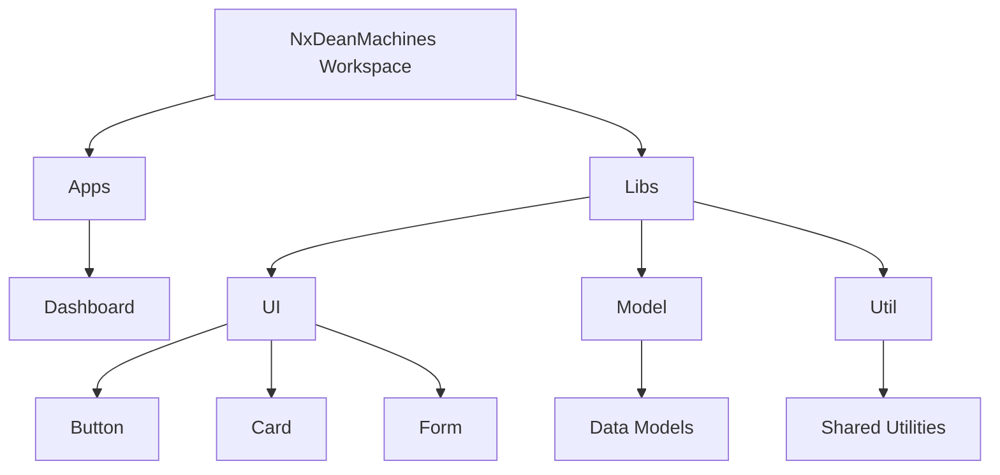

# NxDeanMachines Project Progress

## Current Status: Initial Setup Phase

**Last Updated:** March 21, 2025

## Progress: 35%

## Completed

- ✅ Created Nx workspace with integrated preset
- ✅ Generated initial dashboard application with Vite bundler
- ✅ Set up comprehensive VS Code configurations for optimal Nx development
- ✅ Configured ESLint and Prettier for code quality enforcement
- ✅ Created knowledge base for project architecture and command references
- ✅ Prepared directory structure for planned library categorization
- ✅ Documented development workflow in README.md
- ✅ Implemented VS Code tasks for common Nx commands
- ✅ Fixed ESLint configuration issues in `libs/ui`, `libs/model`, and `libs/util`
- ✅ Verified `tsconfig` files for proper project linking
- ✅ Resolved `nx sync` and workspace synchronization issues

## In Progress

- 🔄 Dashboard application UI development
- 🔄 Library scaffolding for core functionality
- 🔄 Setting up basic CI/CD workflow

## Next Steps

1. **Library Implementation**

   - Generate core UI library in `libs/ui` # card, button, form, card so far
   - Create utility library in `libs/util` for shared helper functions
   - Implement data models in `libs/model`

2. **Application Development**

   - Enhance dashboard with proper routing
   - Implement core UI components
   - Connect with shared libraries

3. **DevOps & Quality**
   - Complete CI/CD pipeline implementation
   - Establish code quality gates
   - Set up Nx Cloud for distributed caching and task execution

## Next Session Focus

1. **UI Library Development**

   - Finalize button component implementation
   - Add card and form components to `libs/ui`
   - Ensure proper TypeScript and ESLint configurations

2. **Utility Library Setup**

   - Create shared utility functions in `libs/util`
   - Add unit tests for utility functions

3. **CI/CD Pipeline**
   - Set up GitHub Actions for automated testing
   - Configure Nx Cloud for task caching

## Architecture Status

| Component            | Status         | Notes                                   |
| -------------------- | -------------- | --------------------------------------- |
| Workspace Structure  | ✅ Complete    | Base structure established              |
| React Application    | 🔄 In Progress | Dashboard app created, needs refinement |
| UI Component Library | 🔄 In Progress | Button component in progress            |
| Feature Libraries    | 📅 Planned     | To follow UI library implementation     |
| Data Libraries       | 📅 Planned     | Will implement after core UI work       |
| CI/CD Pipeline       | 🔄 In Progress | Basic structure defined                 |

## Workspace Structure

## Known Issues

- None at present

## Recent Achievements

- Successfully configured VS Code for optimal Nx development experience
- Established project-wide linting and formatting standards
- Created comprehensive documentation in Monorepo-v1.md
- Resolved ESLint and TypeScript configuration issues

## Team Focus

Current sprint is focused on establishing the foundation of the project's architecture and setting up the core UI library.
